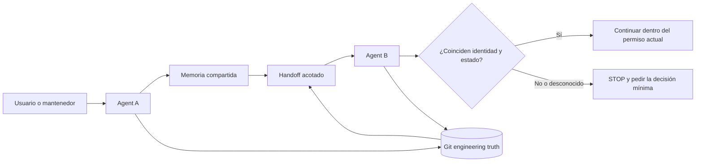

# kang-agent-collab

> Una Skill de colaboración ligera y agnóstica al agente para realizar traspasos fiables entre agentes de programación mediante Git y memoria de proyecto compartida.

[](CHANGELOG.md)
[](LICENSE)
[](SKILL.md)
[](docs/validation.md)

[English](README.md) | [简体中文](README.zh-CN.md) | [日本語](README.ja.md) | [한국어](README.ko.md) | **Español**

`kang-agent-collab` ofrece a distintos agentes de IA un contrato pequeño y compartido para recuperar el contexto del proyecto, comprobar el estado actual del repositorio y transferir el trabajo de forma segura. Es una Skill y un protocolo; no es un orquestador, una plataforma, un servidor ni un sistema de memoria autónomo.

```text
Memoria compartida   explica identidad, decisiones e intención
Git                  demuestra el estado de ingeniería actual
Handoff              transporta el estado mínimo para continuar
Agente receptor      vuelve a verificar antes de continuar
```

No requiere base de datos, demonio, panel, almacén vectorial ni servicio alojado.

## Por qué existe

Un agente que solo recibe un resumen del chat puede reanudar el proyecto equivocado, confiar en un estado obsoleto, sobrescribir cambios ajenos o confundir acceso a herramientas con permiso. Este protocolo convierte esos riesgos en verificaciones y condiciones de parada explícitas.

> La memoria compartida explica el proyecto. Git demuestra el estado de ingeniería. La tarea actual concede permiso. Un Handoff orienta; no es la verdad por sí solo.

## Cómo funciona



El flujo canónico es `START → READ → VERIFY STATE → WORK → VERIFY RESULT → COMMIT → DISTILL → WRITE-BACK CANDIDATE → HANDOFF → TAKEOVER`. El único Skill Contract canónico es [SKILL.md](SKILL.md).

## Principios básicos

- **Identidad antes de actuar.** Un nombre de carpeta parecido no demuestra la identidad del proyecto.
- **Git es la verdad de ingeniería.** En cada toma de control se vuelven a comprobar branch, HEAD, staged, unstaged y untracked.
- **La memoria contiene contexto semántico.** Conserva decisiones e intención, pero no sustituye al repositorio.
- **Capability no equivale a Permission.** Poder escribir o hacer push no significa estar autorizado.
- **Propiedad desconocida significa parar.** Nunca se hace stash, reset, clean ni overwrite silencioso de cambios desconocidos.
- **Referencias antes que duplicación.** Cada Authority mantiene un tipo de verdad para reducir el drift.

## Quick Start

Esta es una integración genérica. La carga de Skills depende del Runtime; verifica el mecanismo documentado para tu agente o harness.

### 1. Obtener el protocolo

```bash
git clone https://github.com/KanG-ciyuan/kang-agent-collab.git
cd kang-agent-collab
```

Indica al agente que lea el [SKILL.md](SKILL.md) raíz. Si el Runtime tiene un directorio de Skills, copia o enlaza el repositorio completo mediante su mecanismo confirmado.

### 2. Añadir Project Identity y Manifest

`.agent-collab/` es un diseño local sugerido, no un servicio obligatorio ni un Registry global.

```bash
mkdir -p /path/to/my-project/.agent-collab
cp examples/minimal-project/PROJECT_IDENTITY.example.yaml /path/to/my-project/.agent-collab/PROJECT_IDENTITY.yaml
cp examples/minimal-project/MANIFEST.example.yaml /path/to/my-project/.agent-collab/MANIFEST.yaml
```

```yaml
project_id: my-project
authoritative_entry: docs/project-authority.md
repository_or_workspace: https://github.com/example/my-project
status: verified
```

### 3. Empezar con Agent A

```text
Usa kang-agent-collab para project_id my-project. Lee Project Identity y el
Manifest actual, verifica de forma independiente el estado Git y realiza solo
la tarea autorizada. Crea un Handoff si otro agente debe continuar.
```

### 4. Crear el Handoff

Usa el [ejemplo de Handoff](examples/handoff-example/HANDOFF.example.yaml). Registra branch, HEAD completo, working tree, evidencias completadas, punto de interrupción, siguiente acción y lo que el siguiente agente no debe hacer.

### 5. Continuar con Agent B

```text
Toma project_id my-project usando el Handoff actual. Vuelve a leer la Authority,
comprueba el repositorio y Git, clasifica el drift y continúa solo si
safe_to_continue es yes.
```

Debe detenerse ante conflictos de identidad, cambios sucios de propietario desconocido, permisos ausentes o drift que no pueda aislarse con seguridad.

## Qué hace realmente un agente

1. Resuelve un `project_id` hacia la entrada autorizada del proyecto.
2. Confirma el canonical repository y la identidad del repositorio.
3. Inspecciona Git en vivo en lugar de confiar en un resumen antiguo.
4. Lee scope, acceptance, permission y stop conditions.
5. Ejecuta solo el trabajo autorizado.
6. Registra el Result State con evidencias.
7. Crea un Write-back Candidate o Handoff acotado solo cuando hace falta.
8. Vuelve a verificar identidad y estado durante el Takeover.

## Project Authority y Git Truth

| Registro | Verdad que mantiene | No sustituye |
|---|---|---|
| Project Authority / memoria compartida | Hechos estables, decisiones, fase y puntero al repositorio | Código y Git actual |
| `PROJECT_IDENTITY` | project_id, canonical repository, Authority pointer y relaciones | Historial de tareas |
| Manifest | Objetivo, scope, acceptance, permisos, rutas de escritura y commit policy | Project Identity |
| Handoff | Resultado, punto de interrupción, evidencias y siguiente acción segura | Manifest o chat completo |
| Git | HEAD, branch, ancestry, tracked content y working tree | Propósito o permisos |

La memoria compartida puede ser una nota de Obsidian, un documento versionado u otra ubicación accesible. Obsidian es opcional y esta Skill no escribe automáticamente en ningún Vault.

## Capability y Permission

Un [Capability Profile](references/capability-profiles.md) solo describe lo que un Runtime concreto puede hacer en condiciones observadas. No concede permiso. `git: available` no autoriza commit, push, reescritura del historial ni descarte de cambios.

## Runtime y compatibilidad

El protocolo es platform-neutral, pero la integración depende del Runtime. El repositorio registra límites de evidencia distintos para Codex, Claude Code, Hermes, OpenClaw, ChatGPT Work y DeepSeek Harness; algunas capacidades son conditional o unknown.

No se afirma universal compatibility. Consulta [Runtime integration](docs/runtime-integration.md) y los [Capability Profiles](references/capability-profiles.md) fechados.

## Estado de validación

`0.2.0` tiene Pilot evidence acotada para:

- fresh-session recovery;
- project identity recovery;
- Authority → canonical repository → live Git recovery;
- clean-state takeover;
- casos observados de dirty / stale Authority;
- comportamiento STOP cuando no es seguro continuar;
- evidencia inicial en más de un Runtime bajo condiciones específicas.

Esto no demuestra todos los agentes, Runtime, tipos de proyecto o modelos de permisos. Level 4 **no está demostrado**. El repositorio público no contiene el paquete completo de reproducción del Pilot privado; por eso los resultados se documentan como evidencia real comunicada por el mantenedor, no como benchmark universal. Consulta [Validation](docs/validation.md).

## Seguridad, limitaciones y estructura

La Skill exige parar ante conflicto de identidad, falta de scope o permission en trabajo de riesgo, propiedad desconocida de cambios (`D3`), ausencia de evidencias necesarias, exceso del Manifest o necesidad de guardar credenciales.

No sincroniza memoria o Git, no escribe automáticamente en Vault, no gestiona worktrees, no selecciona agentes, no programa tareas y no orquesta. La instalación y las herramientas de cada Runtime deben verificarse por separado.

```text
.
├── SKILL.md                       # Único Skill entrypoint canónico
├── references/                   # Canonical contracts y profiles
├── agents/interface.yaml         # Discovery metadata mínima
├── examples/                     # Ejemplos genéricos y sin rutas privadas
├── docs/                         # Architecture, integration, validation
└── .github/                      # Plantillas de contribución
```

- [Architecture](docs/architecture.md)
- [Runtime integration](docs/runtime-integration.md)
- [Validation](docs/validation.md)
- [Shared contracts](references/contracts.md)
- [Capability profiles](references/capability-profiles.md)
- [Contributing](CONTRIBUTING.md)
- [Security](SECURITY.md)
- [Changelog](CHANGELOG.md)

Los README traducidos explican el protocolo; no son Skill Contracts ni Authorities independientes.

## FAQ

**¿Requiere servidor o base de datos?** No. Es una Skill y un protocolo basados en archivos.

**¿Es un Multi-Agent Framework?** No. No selecciona agentes, enruta tareas, programa trabajo ni ejecuta un message bus.

**¿Funciona con cualquier Agent?** Solo puede funcionar cuando el Runtime concreto lee el Contract y accede a las evidencias necesarias; debe verificarse individualmente.

**¿Obsidian es obligatorio?** No. Cualquier documento autorizado y accesible puede servir como memoria compartida.

## Contribución, seguridad y License

Se aceptan mejoras enfocadas en Contracts, ejemplos, runtime evidence y documentación. Una afirmación sobre un Runtime debe incluir identidad, fecha, condiciones y missing evidence. Consulta [CONTRIBUTING.md](CONTRIBUTING.md). No incluyas tokens, passwords, cookies, private keys, Authorization Headers o private local paths en el repositorio, Issues o Handoffs. Para informes privados, consulta [SECURITY.md](SECURITY.md).

Este proyecto se publica bajo la [MIT License](LICENSE). Copyright (c) 2026 KanG-ciyuan.

## Filosofía del proyecto

Mantenerlo pequeño. Mejorar Contracts, ejemplos y evidencias antes de añadir maquinaria. Si una función necesita Scheduler, Database, Dashboard, Registry, Server u Orchestration Layer, probablemente pertenece a otro proyecto.
