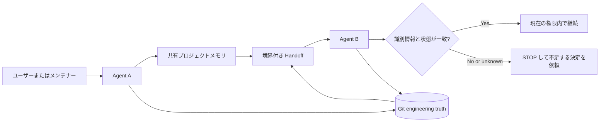

# kang-agent-collab

> Git と共有プロジェクトメモリを使い、AI Coding Agent 間の確実な引き継ぎを支える、軽量で Agent-Agnostic な Collaboration Skill。

[](CHANGELOG.md)
[](LICENSE)
[](SKILL.md)
[](docs/validation.md)

[English](README.md) | [简体中文](README.zh-CN.md) | **日本語** | [한국어](README.ko.md) | [Español](README.es.md)

`kang-agent-collab` は、異なる AI Agent がプロジェクトの文脈を復元し、現在のリポジトリ状態を確認し、安全に作業を引き継ぐための小さな共通契約です。これは Skill とプロトコルであり、オーケストレーター、プラットフォーム、サーバー、自動メモリシステムではありません。

```text
共有プロジェクトメモリ   プロジェクトの識別情報・決定・意図を説明
Git                      現在のエンジニアリング状態を証明
Handoff                  継続に必要な最小状態を伝達
受信 Agent               再検証してから継続
```

データベース、デーモン、ダッシュボード、ベクトルストア、ホスト型サービスは不要です。

## なぜ必要か

チャットの要約だけを受け取った Agent は、別のプロジェクトを再開したり、古い状態を信頼したり、他者の変更を上書きしたり、ツール能力を権限と誤認したりできます。このプロトコルは、それらを明示的な確認事項と停止条件にします。

> 共有メモリはプロジェクトを説明し、Git はエンジニアリング状態を証明し、現在のタスクが権限を与えます。Handoff はナビゲーションであり、真実そのものではありません。

## 仕組み



標準フローは `START → READ → VERIFY STATE → WORK → VERIFY RESULT → COMMIT → DISTILL → WRITE-BACK CANDIDATE → HANDOFF → TAKEOVER` です。唯一の正規 Skill Contract は [SKILL.md](SKILL.md) です。

## 基本原則

- **行動前に Identity を確認。** 類似したフォルダ名はプロジェクト識別の証拠ではありません。
- **Git が engineering truth。** 引き継ぎ時に branch、HEAD、staged、unstaged、untracked を再確認します。
- **メモリは意味的文脈。** 決定と意図を保持しますが、リポジトリの代替ではありません。
- **Capability は Permission ではない。** 書き込みや push が可能でも、現在のタスクで許可されたとは限りません。
- **所有者不明の変更では停止。** 不明な変更を stash、reset、clean、上書きしません。
- **複製より参照。** 各 Authority が一種類の真実を所有し、ドリフトを減らします。

## Quick Start

以下は一般的な導入です。Skill の読み込み方法は Runtime ごとに異なるため、その Runtime の正式な仕組みを確認してください。

### 1. プロトコルを取得

```bash
git clone https://github.com/KanG-ciyuan/kang-agent-collab.git
cd kang-agent-collab
```

Agent にルートの [SKILL.md](SKILL.md) を読ませます。Runtime に Skill ディレクトリがある場合は、確認済みの手順でリポジトリ全体をコピーまたはリンクしてください。

### 2. Project Identity と Manifest を追加

`.agent-collab/` は推奨するプロジェクト内レイアウトであり、必須サービスやグローバル Registry ではありません。

```bash
mkdir -p /path/to/my-project/.agent-collab
cp examples/minimal-project/PROJECT_IDENTITY.example.yaml /path/to/my-project/.agent-collab/PROJECT_IDENTITY.yaml
cp examples/minimal-project/MANIFEST.example.yaml /path/to/my-project/.agent-collab/MANIFEST.yaml
```

```yaml
project_id: my-project
authoritative_entry: docs/project-authority.md
repository_or_workspace: https://github.com/example/my-project
status: verified
```

### 3. Agent A で開始

```text
project_id my-project に kang-agent-collab を使用してください。Project Identity と
現在の Manifest を読み、live Git state を独立して確認し、許可された作業だけを行い、
別の Agent が続ける場合は Handoff を作成してください。
```

### 4. Handoff を作成

[Handoff の例](examples/handoff-example/HANDOFF.example.yaml)を利用できます。branch、完全な HEAD、working tree、完了した証拠、現在の中断点、次の行動、禁止事項を記録します。

### 5. Agent B が引き継ぐ

```text
現在の Handoff を使って project_id my-project を引き継いでください。Authority と
repository と Git を再確認し、drift を分類し、safe_to_continue が yes の場合だけ続けてください。
```

Identity の衝突、所有者不明の変更、権限不足、安全に分離できない drift があれば停止します。

## Agent が実際に行うこと

1. `project_id` から権威あるプロジェクト入口を解決します。
2. canonical repository と repository identity を確認します。
3. 古い要約ではなく live Git state を検査します。
4. scope、acceptance、permission、stop conditions を読みます。
5. 許可された作業だけを実行します。
6. 証拠とともに Result State を記録します。
7. 必要な場合だけ Write-back Candidate または Handoff を作成します。
8. Takeover 時に Identity と状態を再検証します。

## Project Authority と Git Truth

| 記録 | 所有する真実 | 置き換えないもの |
|---|---|---|
| Project Authority / 共有メモリ | 安定したプロジェクト情報、決定、フェーズ、repository pointer | ソースと live Git |
| `PROJECT_IDENTITY` | project_id、canonical repository、Authority pointer、関係 | タスク履歴 |
| Manifest | 目的、scope、acceptance、権限、write path、commit policy | Project Identity |
| Handoff | 結果、中断点、証拠、次の安全な行動 | Manifest やチャットログ |
| Git | HEAD、branch、履歴、tracked content、working tree | 目的や権限 |

共有メモリには Obsidian、バージョン管理された文書、その他 Runtime が読める場所を使えます。Obsidian は必須ではなく、この Skill は Vault へ自動書き込みしません。

## Capability と Permission

[Capability Profile](references/capability-profiles.md) は、特定条件で Runtime ができることを記述するだけで、タスク権限を与えません。`git: available` でも commit、push、履歴書き換え、変更破棄が許可されたとは限りません。

## Runtime と互換性

プロトコルは platform-neutral ですが、統合は Runtime に依存します。現在の記録は Codex、Claude Code、Hermes、OpenClaw、ChatGPT Work、DeepSeek Harness について異なる証拠境界を持ち、一部は conditional または unknown です。

Universal compatibility は主張しません。[Runtime integration](docs/runtime-integration.md) と日付付きの [Capability Profiles](references/capability-profiles.md)を参照してください。

## 検証状態

`0.2.0` には、限定された条件で次の Pilot evidence があります。

- fresh-session recovery
- project identity recovery
- Authority → canonical repository → live Git recovery
- clean-state takeover
- dirty / stale Authority の回復ケース
- 安全に続行できない場合の STOP behavior
- 特定条件での複数 Runtime の初期証拠

これは、すべての Agent、Runtime、プロジェクト種別、権限モデルを証明するものではありません。Level 4 は **未証明** です。公開リポジトリには private Pilot の完全な再現資料がないため、結果は普遍的 benchmark ではなく、メンテナー報告の実 Pilot evidence として記録しています。詳細は [Validation](docs/validation.md) を参照してください。

## 安全モデル、制限、構成

Identity の衝突、risk work の scope/permission 不足、変更所有者不明の `D3`、必要証拠の欠如、Manifest 越境、credential の記録が必要な場合、Skill は停止を要求します。

メモリや Git の同期、Vault への自動 write-back、worktree 管理、Agent 選択、スケジューリング、オーケストレーションは行いません。Runtime 固有のインストールとツール動作は個別検証が必要です。

```text
.
├── SKILL.md                       # 唯一の正規 Skill entrypoint
├── references/                   # Canonical contracts と profiles
├── agents/interface.yaml         # 最小 discovery metadata
├── examples/                     # 一般化された path-free examples
├── docs/                         # Architecture、integration、validation
└── .github/                      # Contribution templates
```

- [Architecture](docs/architecture.md)
- [Runtime integration](docs/runtime-integration.md)
- [Validation](docs/validation.md)
- [Shared contracts](references/contracts.md)
- [Capability profiles](references/capability-profiles.md)
- [Contributing](CONTRIBUTING.md)
- [Security](SECURITY.md)
- [Changelog](CHANGELOG.md)

翻訳 README は説明であり、独立した Skill Contract や別 Authority ではありません。

## FAQ

**サーバーやデータベースは必要ですか？** いいえ。ファイルベースの Skill とプロトコルです。

**Multi-Agent Framework ですか？** いいえ。Agent 選択、タスク routing、schedule、message bus は提供しません。

**すべての Agent で使えますか？** 必要な Contract と証拠を読める具体的 Runtime でのみ可能性があり、個別検証が必要です。

**Obsidian は必須ですか？** いいえ。アクセス可能な権威ある文書なら共有メモリとして利用できます。

## Contribution、Security、License

Contract、example、runtime evidence、documentation への焦点を絞った改善を歓迎します。Runtime claim には identity、date、conditions、missing evidence が必要です。詳細は [CONTRIBUTING.md](CONTRIBUTING.md) を参照してください。Token、password、cookie、private key、Authorization Header、private local path を repository、Issue、Handoff に含めないでください。非公開報告は [SECURITY.md](SECURITY.md) を参照してください。

本プロジェクトは [MIT License](LICENSE) で公開されています。Copyright (c) 2026 KanG-ciyuan。

## Project philosophy

小さく保ちます。機構を増やす前に Contract、example、evidence を改善します。Scheduler、Database、Dashboard、Registry、Server、Orchestration Layer を必要とする機能は、別プロジェクトに属する可能性が高いです。
