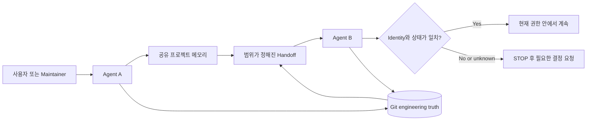

# kang-agent-collab

> Git과 공유 프로젝트 메모리를 사용해 AI Coding Agent 간의 신뢰할 수 있는 인계를 지원하는 경량 Agent-Agnostic Collaboration Skill입니다.

[](CHANGELOG.md)
[](LICENSE)
[](SKILL.md)
[](docs/validation.md)

[English](README.md) | [简体中文](README.zh-CN.md) | [日本語](README.ja.md) | **한국어** | [Español](README.es.md)

`kang-agent-collab`은 서로 다른 AI Agent가 프로젝트 컨텍스트를 복구하고, 현재 저장소 상태를 확인하고, 작업을 안전하게 인계하기 위한 작은 공통 계약입니다. 오케스트레이터, 플랫폼, 서버 또는 자동 메모리 시스템이 아니라 Skill과 프로토콜입니다.

```text
공유 프로젝트 메모리   프로젝트 정체성, 결정, 의도를 설명
Git                    현재 엔지니어링 상태를 증명
Handoff                계속하는 데 필요한 최소 상태를 전달
수신 Agent             모든 항목을 다시 검증한 뒤 계속
```

데이터베이스, 데몬, 대시보드, 벡터 저장소 또는 호스팅 서비스가 필요하지 않습니다.

## 왜 필요한가

채팅 요약만 받은 Agent는 잘못된 프로젝트를 재개하거나, 오래된 상태를 신뢰하거나, 다른 Agent의 변경을 덮어쓰거나, 도구 접근을 권한으로 오해할 수 있습니다. 이 프로토콜은 이런 실패 모드를 명시적인 확인 항목과 중지 조건으로 바꿉니다.

> 공유 메모리는 프로젝트를 설명하고, Git은 엔지니어링 상태를 증명하며, 현재 작업이 권한을 부여합니다. Handoff는 안내이지 진실 자체가 아닙니다.

## 작동 방식



표준 흐름은 `START → READ → VERIFY STATE → WORK → VERIFY RESULT → COMMIT → DISTILL → WRITE-BACK CANDIDATE → HANDOFF → TAKEOVER`입니다. 유일한 canonical Skill Contract는 [SKILL.md](SKILL.md)입니다.

## 핵심 원칙

- **행동 전에 Identity 확인.** 비슷한 폴더 이름은 프로젝트 정체성의 증거가 아닙니다.
- **Git이 engineering truth.** 인계 시 branch, HEAD, staged, unstaged, untracked 상태를 다시 확인합니다.
- **메모리는 의미 컨텍스트.** 결정과 의도를 전달하지만 저장소를 대체하지 않습니다.
- **Capability는 Permission이 아닙니다.** Runtime이 write 또는 push할 수 있어도 현재 작업에서 허용된 것은 아닙니다.
- **변경 소유권이 불명확하면 중지.** 알 수 없는 변경을 stash, reset, clean 또는 overwrite하지 않습니다.
- **복제보다 참조.** 각 Authority가 한 종류의 진실만 소유하도록 해 drift를 줄입니다.

## Quick Start

아래는 일반적인 설정입니다. Skill 로딩은 Runtime마다 다르므로 해당 Runtime에서 검증된 메커니즘을 사용하세요.

### 1. 프로토콜 받기

```bash
git clone https://github.com/KanG-ciyuan/kang-agent-collab.git
cd kang-agent-collab
```

Agent가 루트 [SKILL.md](SKILL.md)를 읽게 합니다. Runtime에 Skill 디렉터리가 있다면 공식적으로 확인된 방법에 따라 전체 저장소를 복사하거나 링크하세요.

### 2. Project Identity와 Manifest 추가

`.agent-collab/`은 권장 프로젝트 내부 레이아웃이며 필수 서비스나 전역 Registry가 아닙니다.

```bash
mkdir -p /path/to/my-project/.agent-collab
cp examples/minimal-project/PROJECT_IDENTITY.example.yaml /path/to/my-project/.agent-collab/PROJECT_IDENTITY.yaml
cp examples/minimal-project/MANIFEST.example.yaml /path/to/my-project/.agent-collab/MANIFEST.yaml
```

```yaml
project_id: my-project
authoritative_entry: docs/project-authority.md
repository_or_workspace: https://github.com/example/my-project
status: verified
```

### 3. Agent A로 작업 시작

```text
project_id my-project에 kang-agent-collab을 사용하세요. Project Identity와 현재
Manifest를 읽고 live Git state를 독립적으로 확인한 뒤 허용된 작업만 수행하세요.
다른 Agent가 계속해야 하면 Handoff를 만드세요.
```

### 4. Handoff 작성

[Handoff 예시](examples/handoff-example/HANDOFF.example.yaml)를 출발점으로 사용할 수 있습니다. 정확한 branch, 전체 HEAD, working tree 상태, 완료 증거, 현재 중단점, 다음 행동, 금지 사항을 기록합니다.

### 5. Agent B가 인계

```text
현재 Handoff로 project_id my-project를 인계받으세요. Authority, repository,
Git을 다시 확인하고 drift를 분류한 뒤 safe_to_continue가 yes일 때만 계속하세요.
```

Identity 충돌, 소유권 불명 변경, 권한 누락 또는 안전하게 격리할 수 없는 drift가 있으면 중지합니다.

## Agent가 실제로 하는 일

1. `project_id`를 authoritative project entry로 연결합니다.
2. canonical repository와 repository identity를 확인합니다.
3. 오래된 요약 대신 live Git state를 검사합니다.
4. scope, acceptance, permission, stop conditions를 읽습니다.
5. 허용된 작업만 수행합니다.
6. 증거와 함께 Result State를 기록합니다.
7. 필요할 때만 제한된 Write-back Candidate 또는 Handoff를 만듭니다.
8. Takeover에서 Identity와 상태를 다시 검증합니다.

## Project Authority와 Git Truth

| 기록 | 소유하는 진실 | 대체하지 않는 것 |
|---|---|---|
| Project Authority / 공유 메모리 | 안정된 프로젝트 사실, 결정, 단계, repository pointer | 소스와 live Git |
| `PROJECT_IDENTITY` | project_id, canonical repository, Authority pointer, 관계 | 작업 이력 |
| Manifest | 목표, scope, acceptance, 권한, write path, commit policy | Project Identity |
| Handoff | 결과, 중단점, 증거, 다음 안전 행동 | Manifest 또는 채팅 로그 |
| Git | HEAD, branch, ancestry, tracked content, working tree | 프로젝트 목적 또는 권한 |

공유 메모리는 Obsidian 노트, 버전 관리 문서 또는 Runtime이 접근할 수 있는 다른 위치일 수 있습니다. Obsidian은 필수가 아니며 이 Skill은 Vault에 자동으로 write-back하지 않습니다.

## Capability와 Permission

[Capability Profile](references/capability-profiles.md)은 특정 조건에서 Runtime이 무엇을 할 수 있는지 설명할 뿐 현재 작업 권한을 부여하지 않습니다. `git: available`은 commit, push, history rewrite 또는 변경 폐기 권한을 의미하지 않습니다.

## Runtime과 호환성

프로토콜은 platform-neutral이지만 통합은 Runtime에 따라 달라집니다. 현재 기록에는 Codex, Claude Code, Hermes, OpenClaw, ChatGPT Work, DeepSeek Harness에 대해 서로 다른 증거 경계가 있으며 일부 값은 conditional 또는 unknown입니다.

Universal compatibility를 주장하지 않습니다. [Runtime integration](docs/runtime-integration.md)과 날짜가 있는 [Capability Profiles](references/capability-profiles.md)를 확인하세요.

## 검증 상태

`0.2.0`은 제한된 조건에서 다음 Pilot evidence를 가지고 있습니다.

- fresh-session recovery
- project identity recovery
- Authority → canonical repository → live Git recovery
- clean-state takeover
- dirty / stale Authority 복구 사례
- 안전하게 계속할 수 없을 때의 STOP behavior
- 특정 조건에서 둘 이상의 Runtime에 대한 초기 증거

이는 모든 Agent, Runtime, 프로젝트 유형 또는 권한 모델을 증명하지 않습니다. Level 4는 **입증되지 않았습니다**. 공개 저장소에는 private Pilot의 전체 재현 자료가 없으므로 결과를 universal benchmark가 아닌 maintainer-reported Pilot evidence로 기록합니다. [Validation](docs/validation.md)을 참고하세요.

## 안전 모델, 제한, 구조

Identity 충돌, 위험 작업의 scope/permission 누락, 소유권 불명 변경(`D3`), 필요한 증거 부재, Manifest 범위 초과 또는 credential 기록이 필요한 경우 Skill은 중지를 요구합니다.

메모리나 Git을 동기화하지 않으며, Vault 자동 write-back, worktree 관리, Agent 선택, scheduling, orchestration을 하지 않습니다. Runtime별 설치와 도구 동작은 개별 검증이 필요합니다.

```text
.
├── SKILL.md                       # 유일한 canonical Skill entrypoint
├── references/                   # Canonical contracts와 profiles
├── agents/interface.yaml         # 최소 discovery metadata
├── examples/                     # 일반화된 path-free examples
├── docs/                         # Architecture, integration, validation
└── .github/                      # Contribution templates
```

- [Architecture](docs/architecture.md)
- [Runtime integration](docs/runtime-integration.md)
- [Validation](docs/validation.md)
- [Shared contracts](references/contracts.md)
- [Capability profiles](references/capability-profiles.md)
- [Contributing](CONTRIBUTING.md)
- [Security](SECURITY.md)
- [Changelog](CHANGELOG.md)

번역 README는 설명 문서이며 별도의 Skill Contract나 Authority가 아닙니다.

## FAQ

**서버나 데이터베이스가 필요합니까?** 아니요. 파일 기반 Skill과 프로토콜입니다.

**Multi-Agent Framework입니까?** 아니요. Agent 선택, task routing, scheduling 또는 message bus를 제공하지 않습니다.

**모든 Agent에서 사용할 수 있습니까?** 필요한 Contract와 증거를 읽을 수 있는 구체적인 Runtime에서만 가능성이 있으며 개별 검증이 필요합니다.

**Obsidian이 필수입니까?** 아니요. 접근 가능한 authoritative document를 공유 메모리로 사용할 수 있습니다.

## 기여, 보안, License

Contract, examples, runtime evidence, documentation에 집중된 개선을 환영합니다. Runtime claim에는 identity, date, conditions, missing evidence가 포함되어야 합니다. [CONTRIBUTING.md](CONTRIBUTING.md)를 확인하세요. Token, password, cookie, private key, Authorization Header 또는 private local path를 repository, Issue, Handoff에 포함하지 마세요. 비공개 신고는 [SECURITY.md](SECURITY.md)를 참고하세요.

이 프로젝트는 [MIT License](LICENSE)로 공개됩니다. Copyright (c) 2026 KanG-ciyuan.

## Project philosophy

작게 유지합니다. 장치를 추가하기 전에 Contract, examples, evidence를 개선합니다. Scheduler, Database, Dashboard, Registry, Server 또는 Orchestration Layer가 필요한 기능은 다른 프로젝트에 속할 가능성이 큽니다.
