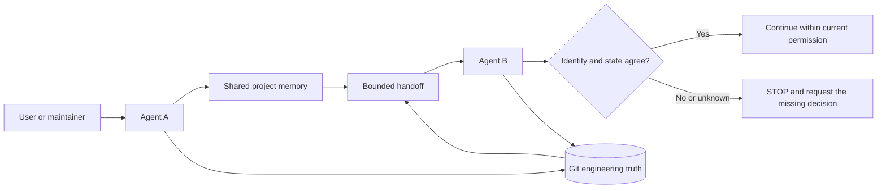

# kang-agent-collab

> A lightweight, agent-agnostic collaboration skill for reliable project handoffs across AI coding agents using Git and shared project memory.

[](CHANGELOG.md)
[](LICENSE)
[](SKILL.md)
[](docs/validation.md)

**English** | [简体中文](README.zh-CN.md) | [日本語](README.ja.md) | [한국어](README.ko.md) | [Español](README.es.md)

`kang-agent-collab` gives different AI agents a small, shared contract for recovering project context, checking the live repository, and handing work over safely. It is a Skill and protocol—not an orchestrator, platform, server, or autonomous memory system.

```text
Shared project memory   explains identity, decisions, and intent
Git                     proves the current engineering state
Handoff                 carries the smallest useful continuation state
Receiving agent         re-verifies everything before continuing
```

No database, daemon, dashboard, vector store, or hosted service is required.

## Why it exists

An agent that receives only a chat summary can easily resume the wrong project, trust stale state, overwrite another agent's changes, or confuse tool access with permission. This protocol makes those failure modes explicit.

Its core rule is simple:

> Shared memory explains the project. Git proves the engineering state. The current task grants permission. A handoff is navigation—not truth.

## How it works



The canonical workflow is `START → READ → VERIFY STATE → WORK → VERIFY RESULT → COMMIT → DISTILL → WRITE-BACK CANDIDATE → HANDOFF → TAKEOVER`. See [SKILL.md](SKILL.md) for the canonical Skill contract.

## Core principles

- **Identity before action.** A similar folder name is not proof of project identity.
- **Git is engineering truth.** Branch, HEAD, staged, unstaged, and untracked state are checked at takeover.
- **Memory is semantic context.** It carries decisions and intent, not a substitute copy of the repository.
- **Capability is not permission.** A runtime may be able to write, push, browse, or deploy without being authorized to do so.
- **Unknown ownership means stop.** Dirty changes are never silently stashed, reset, cleaned, or overwritten.
- **References beat duplication.** Each authority owns one kind of truth, reducing drift.

## Quick start

This is a generic setup. Runtime-specific Skill loading varies, so verify the loading mechanism in your agent or harness.

### 1. Get the protocol

```bash
git clone https://github.com/KanG-ciyuan/kang-agent-collab.git
cd kang-agent-collab
```

Point your agent at the repository's canonical [SKILL.md](SKILL.md). If your runtime has a Skill directory, copy or link this repository according to that runtime's documented mechanism.

For installers that support the Agent Skills registry format, this is the expected command after the public repository is available:

```bash
npx skills add KanG-ciyuan/kang-agent-collab
```

This installer path is runtime-dependent and should be verified with an isolated install check. The Git clone and direct `SKILL.md` reference above are the generic path.

### Prerequisites

- [ ] The receiving runtime can read the root `SKILL.md` and its relative references.
- [ ] The runtime has explicit access to the adopting project's authority and repository.
- [ ] Git is available when engineering state must be verified.
- [ ] Write, commit, push, deployment, network, and cost permissions are stated separately.

### 2. Add project identity and a task manifest

The `.agent-collab/` directory below is a suggested project-local layout, not a required service or global registry.

```bash
mkdir -p /path/to/my-project/.agent-collab
cp examples/minimal-project/PROJECT_IDENTITY.example.yaml /path/to/my-project/.agent-collab/PROJECT_IDENTITY.yaml
cp examples/minimal-project/MANIFEST.example.yaml /path/to/my-project/.agent-collab/MANIFEST.yaml
```

Edit the placeholders so the identity is explicit:

```yaml
project_id: my-project
authoritative_entry: docs/project-authority.md
repository_or_workspace: https://github.com/example/my-project
status: verified
```

### 3. Natural-language examples for Agent A

The contract is language-independent. For example, in Chinese, **你可以直接这样说**：

Use a natural-language request such as:

```text
Use kang-agent-collab for project_id my-project. Read the project identity and
current Manifest, verify the live Git state, complete the allowed task, and
produce a handoff if another agent must continue.
```

The agent should identify the project, read the smallest necessary authority, verify Git independently, work only inside the Manifest, and return evidence.

### 4. Hand off

Use [the handoff example](examples/handoff-example/HANDOFF.example.yaml) as a starting point. A useful engineering handoff records the exact branch and full HEAD, working-tree state, completed evidence, breakpoint, next action, and anything the next agent must not do.

### 5. Continue with Agent B

```text
Take over project_id my-project using the current handoff. Re-read the
authoritative entry, re-check the repository and Git state, classify drift,
and continue only if safe_to_continue is yes.
```

Agent B must verify the handoff against the current authority and live Git state. It must stop on identity conflict, unknown dirty-change ownership, missing permission, or material drift that cannot be isolated.

### 6. Verify the package

Basic repository checks require no service. If you use `kang-meta-skill`, its validator can inspect the package:

```bash
python3 /path/to/kang-meta-skill/scripts/validate_skill.py .
```

Replace the path with your installed validator location. This command validates package structure; it does not prove runtime compatibility or Pilot outcomes.

## What an agent actually does

1. Resolves a known `project_id` to an authoritative project entry.
2. Confirms the canonical repository and repository identity.
3. Inspects live Git state instead of trusting a stale summary.
4. Reads current scope, acceptance criteria, permissions, and stop conditions.
5. Performs only the authorized work.
6. Records a result state with evidence.
7. Produces a bounded write-back candidate or handoff only when needed.
8. Re-verifies identity and state during takeover.

## Project authority and Git truth

Different records have different jobs:

| Record | Owns | Does not replace |
|---|---|---|
| Project authority / shared memory | Stable project truth, decisions, current phase, and repository pointer | Source files or live Git state |
| `PROJECT_IDENTITY` | Project ID, canonical repository, authority pointer, project relationships | Task history |
| Manifest | Current objective, scope, acceptance, permissions, write paths, and commit policy | Project identity |
| Handoff | Previous result, exact breakpoint, current evidence, next safe action | The Manifest or chat transcript |
| Git | HEAD, branch, ancestry, tracked content, and working-tree state | Project purpose or permission |

Shared memory can be an Obsidian note, a versioned project document, or another location the current runtime can access. Obsidian is optional; no automatic Vault write-back is performed by this Skill.

## Capability vs. permission

A [Capability Profile](references/capability-profiles.md) describes what a concrete runtime can access or execute under observed conditions. It never grants permission for the current task. Permission belongs in the Manifest or an explicit user instruction.

For example, `git: available` means the runtime can run Git. It does not mean the agent may commit, push, rewrite history, or discard changes.

## Runtime model

The protocol is platform-neutral, but integration is runtime-dependent.

| Runtime profile | Current evidence boundary |
|---|---|
| Codex local | Skill loading and core local tools observed in a dated local environment; access remains session-specific |
| Claude Code | Local Skill and repository capabilities recorded for a specific tested version; optional integrations remain conditional |
| Hermes | Indexed Skill loading observed; active toolsets and path access must be rechecked |
| OpenClaw | Workspace/shared Skill roots observed; tool grants remain agent-specific |
| ChatGPT Work | Text contract exchange is possible; local Skill loading and tools are session-dependent |
| DeepSeek Harness | Operational capabilities remain unknown until a concrete harness is verified |

These profiles do **not** establish universal compatibility. See [Runtime integration](docs/runtime-integration.md) and the dated canonical [capability profiles](references/capability-profiles.md).

## Validation status

Version `0.2.0` has bounded Pilot evidence for:

- fresh-session recovery;
- project identity recovery;
- authority → canonical repository → live Git recovery;
- clean-state takeover;
- observed dirty or stale-authority recovery cases;
- safe STOP behavior when continuation is not justified;
- more than one runtime under specific tested conditions.

This is not proof for every agent, runtime, project type, or permission model. Level 4 is **not proven**. The public repository does not currently include a full reproducibility bundle for the private Pilot, so those results are documented as maintainer-reported Pilot evidence rather than a universal benchmark. See [Validation and evidence boundaries](docs/validation.md).

## Safety model

The Skill stops rather than guessing when:

- project identity conflicts or is ambiguous;
- risky work lacks scope, acceptance criteria, write paths, or permission;
- dirty-change ownership is unknown (`D3`);
- required evidence cannot be produced;
- continuation would exceed the Manifest or alter another agent's work;
- credentials would need to enter a handoff, shared memory, or Git.

It does not automatically write to shared memory, manage worktrees, select agents, schedule tasks, or perform orchestration.

## Repository structure

```text
.
├── SKILL.md                       # Canonical Skill entrypoint
├── references/
│   ├── contracts.md               # Canonical schemas and drift rules
│   └── capability-profiles.md     # Dated runtime observations
├── agents/interface.yaml          # Minimal discovery metadata
├── examples/                      # Generic, path-free examples
├── docs/                          # Architecture, integration, validation
└── .github/                       # Contribution templates
```

The repository has exactly one canonical `SKILL.md`. Translated README files explain the protocol but do not create translated Skill contracts.

## Documentation

- [Architecture and mental model](docs/architecture.md)
- [Runtime integration](docs/runtime-integration.md)
- [Validation and evidence boundaries](docs/validation.md)
- [Shared contracts](references/contracts.md)
- [Capability profiles](references/capability-profiles.md)
- [Contributing](CONTRIBUTING.md)
- [Security policy](SECURITY.md)
- [Changelog](CHANGELOG.md)

## Limitations

- The Skill does not synchronize memory or Git; agents and users perform those actions with their available tools.
- It cannot make an inaccessible repository, authority, or runtime capability available.
- It does not resolve ambiguous ownership or permission automatically.
- Runtime-specific installation and tool behavior must be verified in that runtime.
- Pilot evidence is bounded and is not a guarantee of autonomous recovery in unfamiliar environments.

## Troubleshooting

| Symptom | Likely cause | Safe action |
|---|---|---|
| The agent cannot find the Skill | The runtime does not discover this repository layout | Point it directly to the root `SKILL.md` or use the runtime's documented Skill directory |
| Authority and repository identity conflict | A pointer is stale or the wrong project was selected | Set identity to `to_verify` and request the maintainer's decision |
| Handoff says clean but Git is dirty | State changed after the handoff | Recheck ownership and classify drift; never reset unknown changes |
| The runtime can push but the task does not mention publication | Capability was mistaken for permission | Keep work local and request explicit permission |
| Shared memory is inaccessible | The path or integration is unavailable in this session | Request the smallest required entry instead of guessing |

## FAQ

<details>
<summary>Does this require a server or database?</summary>

No. It is a file-based Skill and protocol. You may use an existing shared-memory system, but the protocol does not operate one.
</details>

<details>
<summary>Is this a multi-agent framework?</summary>

No. It does not choose agents, route tasks, schedule work, or run a message bus. It only defines how project state is recovered and handed over.
</details>

<details>
<summary>Can any AI agent use it?</summary>

Potentially, if the runtime can read the contract and access the required project evidence. That must be verified per runtime; universal compatibility is not claimed.
</details>

<details>
<summary>Is Obsidian required?</summary>

No. Obsidian is one possible shared-memory location. A versioned document or another accessible authority can serve the same role.
</details>

<details>
<summary>What happens when memory and Git disagree?</summary>

Live Git remains the engineering truth. If the disagreement creates an identity conflict or unsafe drift, the agent stops and requests the minimum missing decision.
</details>

## Contributing

Focused improvements to the contracts, examples, runtime evidence, and documentation are welcome. Claims about a runtime must include the runtime identity, date, tested capabilities, conditions, and missing evidence. See [CONTRIBUTING.md](CONTRIBUTING.md).

## Security

Do not place tokens, passwords, cookies, private keys, authorization headers, or private local paths in Manifests, Handoffs, shared memory, examples, issues, or commits. See [SECURITY.md](SECURITY.md) for private reporting guidance.

## License

Released under the [MIT License](LICENSE). Copyright (c) 2026 KanG-ciyuan.

## Project philosophy

Keep it small. Improve contracts, examples, and evidence before adding machinery. If a proposed feature needs a scheduler, database, dashboard, registry, server, or orchestration layer, it probably belongs in another project.
