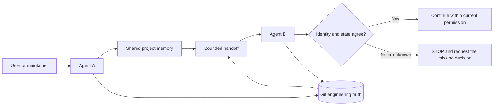

# kang-agent-collab

English | [简体中文](README.zh-CN.md) | [日本語](README.ja.md) | [한국어](README.ko.md) | [Español](README.es.md)

[](https://github.com/KanG-ciyuan/kang-agent-collab/releases)
[](LICENSE)
[](https://github.com/KanG-ciyuan/kang-agent-collab/commits/main)

> A lightweight, agent-agnostic collaboration skill for reliable project handoffs across AI coding agents using Git and shared project memory.

`kang-agent-collab` gives different AI agents a small, shared contract for recovering project context, checking the live repository, and handing work over safely. It is a Skill and protocol—not an orchestrator, platform, server, or autonomous memory system.

```text
Shared project memory   explains identity, decisions, and intent
Git                     proves the current engineering state
Handoff                 carries the smallest useful continuation state
Receiving agent         re-verifies everything before continuing
```

No database, daemon, dashboard, vector store, or hosted service is required. This repository is a file-based interoperability contract: a text spec, YAML schemas, and templates. No code here enforces it at runtime.

## Why it exists

An agent that receives only a chat summary can easily resume the wrong project, trust stale state, overwrite another agent's changes, or confuse tool access with permission. This protocol makes those failure modes explicit.

Its core rule is simple:

> Shared memory explains the project. Git proves the engineering state. The current task grants permission. A handoff is navigation—not truth.

### Wrong way, right way

| Wrong way | Right way |
|---|---|
| Resume from a chat summary, or from a folder name that looks familiar | Recover from `project_id` through the authoritative project entry |
| Trust the handoff's description of the repository | Inspect branch, full HEAD, staged, unstaged, and untracked state yourself |
| Treat "the runtime can write" as "I am authorized to write" | Read permission from the Manifest or an explicit instruction |
| Reduce drift by stashing, resetting, or cleaning unknown changes | STOP — unknown change ownership is `D3` |
| Copy project state into every record | Reference the record that owns it |

## How it works



The canonical workflow is `START → READ → VERIFY STATE → WORK → VERIFY RESULT → COMMIT → DISTILL → WRITE-BACK CANDIDATE → HANDOFF → TAKEOVER`. Those ten steps are defined once, in the canonical [SKILL.md](SKILL.md) contract.

## What an agent actually does

1. Resolves a known `project_id` to an authoritative project entry.
2. Confirms the canonical repository and repository identity.
3. Inspects live Git state instead of trusting a stale summary.
4. Reads current scope, acceptance criteria, permissions, and stop conditions.
5. Performs only the authorized work.
6. Records a result state with evidence.
7. Produces a bounded write-back candidate or handoff only when needed.
8. Re-verifies identity and state during takeover.

## Core principles

- **Identity before action.** A similar folder name is not proof of project identity.
- **Git is engineering truth.** Branch, HEAD, staged, unstaged, and untracked state are checked at takeover.
- **Memory is semantic context.** It carries decisions and intent, not a substitute copy of the repository.
- **Capability is not permission.** A runtime may be able to write, push, browse, or deploy without being authorized to do so.
- **Unknown ownership means stop.** Dirty changes are never silently stashed, reset, cleaned, or overwritten.
- **References beat duplication.** Each authority owns one kind of truth, reducing drift.

## Core capabilities

Every rule below is a schema or a prose obligation that a human or an agent is asked to follow. The canonical definitions live in [Shared Contracts](references/contracts.md) and [Capability Profiles](references/capability-profiles.md).

| Capability | What it gives you |
|---|---|
| Project Identity | `project_id`, authoritative entry, canonical repository, project relationships, and a `verified \| historical \| to_verify` status |
| Lite / Full Manifest | Task scope, exclusions, acceptance, write paths, baseline, commit policy, permissions and cost, and stop conditions |
| State Drift `D0`–`D3` | A four-level classification with a required action per level; `D3` stops writes and escalates |
| Result State | `done \| partial \| blocked \| failed`, each recorded with evidence |
| Write-back Candidate | A bounded, candidate-only update to shared memory, defaulting to no automatic write |
| Handoff | Previous result, current engineering state, evidence, breakpoint, next action, blockers, and do-not-do guidance |
| Engineering recovery minimum | A superset Handoff schema for engineering takeover, with a per-field conditional trigger and an explicit required-field list |
| Takeover Check | Eleven re-verification fields, ending in `safe_to_continue: yes \| no` |
| Capability Profile | Dated runtime observations using `available \| conditional \| unavailable \| unknown`, which never grant task permission |

## Outputs and artifacts

The repository ships templates and rules; it never ships a generated instance of them.

| Artifact | Shipped as |
|---|---|
| Lite Manifest, Full Manifest | Schema in [Shared Contracts](references/contracts.md); working template in [`examples/minimal-project/MANIFEST.example.yaml`](examples/minimal-project/MANIFEST.example.yaml) |
| Project Identity record | Schema in [Shared Contracts](references/contracts.md); template in [`examples/minimal-project/PROJECT_IDENTITY.example.yaml`](examples/minimal-project/PROJECT_IDENTITY.example.yaml) |
| Handoff, Takeover Check | Schemas in [Shared Contracts](references/contracts.md); templates in [`examples/handoff-example/`](examples/handoff-example/README.md) |
| Capability Profile | Contract in [Capability Profiles](references/capability-profiles.md); template in [`examples/capability-profile-example/profile.example.yaml`](examples/capability-profile-example/profile.example.yaml) |
| Discovery metadata | [`agents/interface.yaml`](agents/interface.yaml) |
| Package metadata | [`manifest.json`](manifest.json) |
| Release-process records | [`reports/`](reports/prior-art-research.md), including a stored trigger-eval output |

Every `.example.yaml` is a placeholder template, not a filled record — for example [`HANDOFF.example.yaml`](examples/handoff-example/HANDOFF.example.yaml) ships `head: REPLACE_WITH_FULL_40_CHARACTER_COMMIT_SHA`. There is no runnable validator, no eval runner, no installer, and no generated handoff instance in this repository.

At runtime the Skill is asked to return an evidence-backed result state, a safe continuation decision, and — only when a trigger applies — a bounded Handoff or write-back candidate.

## Recovery

Recovering an interrupted task is the reason this protocol exists. For a known `project_id`, the canonical recovery chain is:

```text
project_id
-> Agent Knowledge Routing Index
-> project Obsidian Authority
-> canonical_repo and current recovery state
-> repository PROJECT_IDENTITY
-> live Git state
-> current Manifest or task permissions, when present
-> safe_to_continue decision
```

The routing index is discovery, not another project-state store; it is optional infrastructure that already exists in some environments and this repository neither provides nor requires one. If the runtime cannot reach the index, the Authority, or the repository, it stops and requests the minimum missing entry. It never guesses a path, never selects a semantically similar project, and never infers the canonical repository from a historical folder name. Any identity conflict among the Authority, `PROJECT_IDENTITY`, Git, and the Manifest sets identity to `to_verify` and requires STOP. See [Architecture and mental model](docs/architecture.md) and [SKILL.md](SKILL.md).

## Project authority and Git truth

Different records have different jobs:

| Record | Owns | Does not replace |
|---|---|---|
| Project authority / shared memory | Stable project truth, decisions, current phase, and repository pointer | Source files or live Git state |
| `PROJECT_IDENTITY` | Project ID, canonical repository, authority pointer, project relationships | Task history |
| Manifest | Current objective, scope, acceptance, permissions, write paths, and commit policy | Project identity |
| Handoff | Previous result, exact breakpoint, current evidence, next safe action | The Manifest or chat transcript |
| Git | HEAD, branch, ancestry, tracked content, and working-tree state | Project purpose or permission |

That table is this README's five-record simplification, and the repository contains two other decompositions of the same idea. The canonical contract enumerates **seven** ownership entries — it adds `AGENTS` (stable execution, safety, Git, and project-boundary rules) and `README` (human-facing purpose and stable capabilities), and names the shared-memory owner as `Obsidian Authority`. [Architecture and mental model](docs/architecture.md) frames the separation as **four independent questions** instead: what project is this, what is true in the repository now, what may this agent do, and what can this runtime do, where a positive answer to one does not imply a positive answer to another. Where the files disagree, [Shared Contracts](references/contracts.md) is the canonical definition, as [CONTRIBUTING.md](CONTRIBUTING.md) states.

Shared memory can be an Obsidian note, a versioned project document, or another location the current runtime can access. Obsidian is optional; no automatic Vault write-back is performed by this Skill.

## Capability vs. permission

A [Capability Profile](references/capability-profiles.md) describes what a concrete runtime can access or execute under observed conditions. It never grants permission for the current task. Permission belongs in the Manifest or an explicit user instruction.

For example, `git: available` means the runtime can run Git. It does not mean the agent may commit, push, rewrite history, or discard changes.

## Runtime model

The protocol is platform-neutral, but integration is runtime-dependent. The observations below are dated point-in-time records, not compatibility guarantees; all six carry `last_verified: 2026-09-12`.

| Runtime profile | Current evidence boundary |
|---|---|
| Codex local | Skill loading and core local tools observed in a dated local environment; access remains session-specific |
| Claude Code | Local Skill and repository capabilities recorded for a specific tested version; optional integrations remain conditional |
| Hermes | Indexed Skill loading observed; active toolsets and path access must be rechecked |
| OpenClaw | Workspace/shared Skill roots observed; tool grants remain agent-specific |
| ChatGPT Work | Text contract exchange is possible; local Skill loading and tools are session-dependent |
| DeepSeek Harness | Operational capabilities remain unknown until a concrete harness is verified |

These profiles do **not** establish universal compatibility. See [Runtime integration](docs/runtime-integration.md) and the dated canonical [capability profiles](references/capability-profiles.md).

## Validation status

Protocol version `0.2.0` is consistent across [`manifest.json`](manifest.json), [`SKILL.md`](SKILL.md), [`CHANGELOG.md`](CHANGELOG.md), this README and its four translations, the Git tag `v0.2.0`, and the published `v0.2.0` release. The public Git history is a single release commit that the tag points at; there is no earlier tag or release in this repository.

### Evidence classes used here

| Class | Meaning in this repository | Status |
|---|---|---|
| Repository-verified | Checkable from the current tracked files | `VERIFIED` |
| Maintainer-reported Pilot evidence | Observed by the maintainer under stated conditions; the underlying private artifacts are not published here | `SIMULATED` — asserted, not reproducible from this repository |
| Unknown / to verify | Not supported strongly enough for a public capability claim | `TO_VERIFY` |

### What is repository-verified

| Check | How to reproduce | Observed result |
|---|---|---|
| Repository-consistency suite | `python3 -m unittest discover -s tests -v` | 5 tests, `OK` — stdlib `unittest`; no dependency manifest declares `pytest` |
| Single canonical Skill entrypoint | the same suite | exactly one `SKILL.md` in the tree |
| Version agreement | the same suite | `0.2.0` present in `manifest.json`, `SKILL.md`, and all five READMEs |
| Relative Markdown links | the same suite | every relative link target resolves; no failures |
| Package structure, external and optional | `python3 /path/to/kang-meta-skill/scripts/validate_skill.py .` | `{"ok": true, "failures": [], "warnings": []}` |
| Trigger-boundary fixtures, external and optional | re-run [`evals/trigger_cases.json`](evals/trigger_cases.json) with the `kang-meta-skill` trigger-eval runner | 10/10 cases, `pass_rate 1.0`; the stored [`reports/trigger-eval.json`](reports/trigger-eval.json) reproduced byte-for-byte |

<details>
<summary>What the test suite is, and what it is not</summary>

- It is a real consistency suite, not an existence-check stub. It cross-compares the version across seven files, resolves relative link targets across every Markdown file in the tree, compares the five README language switchers against each other, rejects a second `SKILL.md`, and guards against machine-specific home paths.
- It does **not** exercise the protocol. No test reads any `examples/*.example.yaml`, and no test validates a record against the schemas in [Shared Contracts](references/contracts.md). The D0–D3 rule, the `safe_to_continue` preconditions, the Result-State enum, and the Capability-Profile contract are all unenforced prose.
- Nothing runs automatically. There is no CI: [`.github/`](.github/PULL_REQUEST_TEMPLATE.md) contains issue and pull-request templates only, so the suite, the external validator, and the trigger fixtures never run on a push, pull request, or release. The nine items in `manifest.json` `release_gates` are manual commitments, not automation.
- The trigger fixtures are keyword-scoring fixtures over ten recorded cases against a `0.34` threshold — four `should_trigger`, three `should_not_trigger`, three `near_neighbor`. They are a recorded fixture, not a model-scored evaluation, and they say nothing about runtime behaviour.
- Known coverage gap: the link check uses a negative-lookbehind pattern that does not suppress image-badge wrappers, so badge target links are not link-checked. The badge targets used here were verified by hand.

</details>

### Maintainer-reported Pilot evidence

The maintainer reports bounded Pilot observations for: fresh-session recovery; project identity recovery; authority → canonical repository → live Git recovery; clean-state takeover; recovery when authority was stale or the working tree was dirty; safe STOP behaviour when continuation was not justified; and more than one runtime under specific tested conditions.

Both limits are stated by the repository itself:

- These observations are **maintainer-reported**. No project name, per-case date, runtime log, fixture, or reproduction bundle is published here, and [Validation and evidence boundaries](docs/validation.md) states that the Pilot's private paths and conversation data are intentionally withheld. No benchmark score or universal success rate is inferred from them.
- [`reports/prior-art-research.md`](reports/prior-art-research.md) records that no comparative prior-art evaluation was run for this documentation-only release.

This is not proof for every agent, runtime, project type, or permission model.

## Example: one handoff, end to end

The `.agent-collab/` directory below is a suggested project-local layout, not a required service or global registry.

```bash
mkdir -p /path/to/my-project/.agent-collab
cp examples/minimal-project/PROJECT_IDENTITY.example.yaml /path/to/my-project/.agent-collab/PROJECT_IDENTITY.yaml
cp examples/minimal-project/MANIFEST.example.yaml /path/to/my-project/.agent-collab/MANIFEST.yaml
```

Edit the placeholders so the identity is explicit:

```yaml
project_id: my-project
authoritative_entry: docs/project-authority.md
repository_or_workspace: https://github.com/example/my-project
status: verified
```

### Agent A: do the authorized work

The contract is language-independent — one of the ten shipped trigger fixtures is written in Chinese — and the request is ordinary natural language:

```text
Use kang-agent-collab for project_id my-project. Read the project identity and
current Manifest, verify the live Git state, complete the allowed task, and
produce a handoff if another agent must continue.
```

The agent should identify the project, read the smallest necessary authority, verify Git independently, work only inside the Manifest, and return evidence.

### Hand off

Start from [the handoff example](examples/handoff-example/HANDOFF.example.yaml) and its matching [takeover check](examples/handoff-example/TAKEOVER_CHECK.example.yaml). A useful engineering handoff records the exact branch and full HEAD, working-tree state, completed evidence, breakpoint, next action, and anything the next agent must not do.

### Agent B: take over

```text
Take over project_id my-project using the current handoff. Re-read the
authoritative entry, re-check the repository and Git state, classify drift,
and continue only if safe_to_continue is yes.
```

Agent B must verify the handoff against the current authority and live Git state. It must stop on identity conflict, unknown dirty-change ownership, missing permission, or material drift that cannot be isolated.

All three example directories are listed in [`examples/`](examples/README.md), and their `.example.yaml` files are placeholders rather than canonical contracts — if an example conflicts with [Shared Contracts](references/contracts.md), the contract wins.

## When to use it, and when not to

Use it when a task requires one or more of:

- resuming a project from shared memory and Git;
- verifying project identity or current engineering state;
- preparing or consuming a cross-agent handoff;
- recording a bounded write-back candidate;
- recovering an interrupted task without full chat history.

Do not use it to choose agents, delegate roles, schedule work, create infrastructure, or grant permissions. It is not an orchestrator, scheduler, message bus, database, memory server, vector store, registry, dashboard, automatic write-back service, or agent-selection layer, and it does not manage worktrees.

**Team composition is a different job.** The canonical Skill contract states the boundary in [SKILL.md](SKILL.md): *"If team composition or specialist delegation is the job, route to `kang-agent-workforce`; that Skill may reference this contract for state transfer."* In one line: **Workforce defines the team. Collab protects the handoff.** That is a scope statement recorded in the Skill contract, not a dependency — no sibling project is imported, validated against, or required by this repository. The boundary is deliberate: the shipped trigger fixtures classify "choose an agent and delegate roles for a new product team" as `should_not_trigger`.

## Safety model

The Skill stops rather than guessing when:

- project identity conflicts or is ambiguous;
- risky work lacks scope, acceptance criteria, write paths, or permission;
- dirty-change ownership is unknown (`D3`);
- required evidence cannot be produced;
- continuation would exceed the Manifest or alter another agent's work;
- credentials would need to enter a handoff, shared memory, or Git.

It does not automatically write to shared memory, manage worktrees, select agents, schedule tasks, or perform orchestration. The default permission in [`manifest.json`](manifest.json) is read-only recovery and verification; file writes require current task permission, commits require the Manifest or explicit permission, pushes require explicit publication permission, and shared-memory writes are candidate-only unless explicitly authorized.

## Quick start

This is a generic setup. Runtime-specific Skill loading varies, so verify the loading mechanism in your agent or harness.

### Prerequisites

- [ ] The receiving runtime can read the root `SKILL.md` and its relative references.
- [ ] The runtime has explicit access to the adopting project's authority and repository.
- [ ] Git is available when engineering state must be verified.
- [ ] Write, commit, push, deployment, network, and cost permissions are stated separately.

### 1. Get the protocol

```bash
git clone https://github.com/KanG-ciyuan/kang-agent-collab.git
cd kang-agent-collab
```

Point your agent at the repository's canonical [SKILL.md](SKILL.md). If your runtime has a Skill directory, copy or link this repository according to that runtime's documented mechanism. [Runtime integration](docs/runtime-integration.md) lists three generic patterns: repository reference, Skill directory, and instruction attachment.

For installers that support the Agent Skills registry format, the expected command is:

```bash
npx skills add KanG-ciyuan/kang-agent-collab
```

This installer path is runtime-dependent and has **not** been independently verified here — [`manifest.json`](manifest.json) still lists the isolated installation check as an open release gate. Run it as an isolated install check before relying on it. The Git clone and direct `SKILL.md` reference above are the generic path.

### 2. Verify the package

Basic repository checks require no service:

```bash
python3 -m unittest discover -s tests -v
```

If you use `kang-meta-skill`, its validator can inspect the package:

```bash
python3 /path/to/kang-meta-skill/scripts/validate_skill.py .
```

Replace the path with your installed validator location. This command validates package structure; it does not prove runtime compatibility or Pilot outcomes.

## Limitations

- The Skill does not synchronize memory or Git; agents and users perform those actions with their available tools.
- It cannot make an inaccessible repository, authority, or runtime capability available.
- It does not resolve ambiguous ownership or permission automatically.
- Runtime-specific installation and tool behavior must be verified in that runtime.
- Pilot evidence is bounded and is not a guarantee of autonomous recovery in unfamiliar environments.
- Nothing in this repository enforces the protocol at runtime: there is no CI, no validator of its own, and no test that checks an example record against a contract schema.
- The translations are not all equivalent: `README.zh-CN.md` is a full translation of this file, while `README.es.md`, `README.ja.md`, and `README.ko.md` are condensed and currently omit the Prerequisites, Troubleshooting, and FAQ sections. Treat this English README as the complete reference.

## Troubleshooting

| Symptom | Likely cause | Safe action |
|---|---|---|
| The agent cannot find the Skill | The runtime does not discover this repository layout | Point it directly to the root `SKILL.md` or use the runtime's documented Skill directory |
| Authority and repository identity conflict | A pointer is stale or the wrong project was selected | Set identity to `to_verify` and request the maintainer's decision |
| Handoff says clean but Git is dirty | State changed after the handoff | Recheck ownership and classify drift; never reset unknown changes |
| The runtime can push but the task does not mention publication | Capability was mistaken for permission | Keep work local and request explicit permission |
| Shared memory is inaccessible | The path or integration is unavailable in this session | Request the smallest required entry instead of guessing |

## Repository structure

<details>
<summary>Show the tracked tree</summary>

```text
.
├── SKILL.md                          # The one canonical Skill entrypoint
├── manifest.json                     # Package metadata, permissions, release gates
├── references/
│   ├── contracts.md                  # Canonical contract definitions (the normative spec)
│   └── capability-profiles.md        # Dated runtime observation record
├── docs/
│   ├── architecture.md               # Mental model, recovery chain, non-components
│   ├── runtime-integration.md        # Integration patterns and per-runtime notes
│   └── validation.md                 # Evidence classes and claim boundary
├── examples/                         # Generic, path-free placeholder templates
├── agents/interface.yaml             # Minimal discovery metadata
├── tests/test_repository.py          # Five repository-consistency tests
├── evals/trigger_cases.json          # Ten recorded trigger-boundary fixtures
├── reports/                          # Release-process records and stored eval output
├── .github/                          # Issue and pull-request templates (no workflows)
├── README.md                         # English canonical README
├── README.zh-CN.md                   # Simplified Chinese
├── README.ja.md                      # Japanese (condensed)
├── README.ko.md                      # Korean (condensed)
├── README.es.md                      # Spanish (condensed)
├── CHANGELOG.md
├── CONTRIBUTING.md
├── SECURITY.md
├── CODE_OF_CONDUCT.md
└── LICENSE                           # MIT
```

</details>

The repository has exactly one canonical `SKILL.md`. Translated README files explain the protocol but do not create translated Skill contracts or additional authorities.

## Documentation

- [Architecture and mental model](docs/architecture.md)
- [Runtime integration](docs/runtime-integration.md)
- [Validation and evidence boundaries](docs/validation.md)
- [Shared contracts](references/contracts.md)
- [Capability profiles](references/capability-profiles.md)
- [Examples](examples/README.md)
- [Contributing](CONTRIBUTING.md)
- [Security policy](SECURITY.md)
- [Changelog](CHANGELOG.md)

## FAQ

<details>
<summary>Does this require a server or database?</summary>

No. It is a file-based Skill and protocol. You may use an existing shared-memory system, but the protocol does not operate one.
</details>

<details>
<summary>Is this a multi-agent framework?</summary>

No. It does not choose agents, route tasks, schedule work, or run a message bus. It only defines how project state is recovered and handed over.
</details>

<details>
<summary>Can any AI agent use it?</summary>

Potentially, if the runtime can read the contract and access the required project evidence. That must be verified per runtime; universal compatibility is not claimed.
</details>

<details>
<summary>Is Obsidian required?</summary>

No. Obsidian is one possible shared-memory location. A versioned document or another accessible authority can serve the same role.
</details>

<details>
<summary>What happens when memory and Git disagree?</summary>

Live Git remains the engineering truth. If the disagreement creates an identity conflict or unsafe drift, the agent stops and requests the minimum missing decision.
</details>

## Contributing

Focused improvements to the contracts, examples, runtime evidence, and documentation are welcome. Claims about a runtime must include the runtime identity, date, tested capabilities, conditions, and missing evidence. See [CONTRIBUTING.md](CONTRIBUTING.md).

## Security

Do not place tokens, passwords, cookies, private keys, authorization headers, or private local paths in Manifests, Handoffs, shared memory, examples, issues, or commits. See [SECURITY.md](SECURITY.md) for private reporting guidance.

## Project philosophy

Keep it small. Improve contracts, examples, and evidence before adding machinery. If a proposed feature needs a scheduler, database, dashboard, registry, server, or orchestration layer, it probably belongs in another project.

---

## Part of the Kang Open-Source AI System

This project is one part of an evidence-driven system for enterprise AI transformation,
agent collaboration, and AI-native product delivery.

| Stage | Project | Role |
| --- | --- | --- |
| DISCOVER | [enterprise-ai-diagnostic-skills](https://github.com/KanG-ciyuan/enterprise-ai-diagnostic-skills) | Understand how the business actually works before automating it |
| DEFINE | [kang-product-architect](https://github.com/KanG-ciyuan/kang-product-architect) | Turn ambiguous requirements into an implementation-ready product contract |
| DEFINE | [kang-enterprise-process-reviewer](https://github.com/KanG-ciyuan/kang-enterprise-process-reviewer) | Review whether workflows are executable, accountable and recoverable |
| BUILD & COORDINATE | [kang-agent-workforce](https://github.com/KanG-ciyuan/kang-agent-workforce) | Role-based AI product workforce with explicit handoffs |
| BUILD & COORDINATE | [kang-agent-collab](https://github.com/KanG-ciyuan/kang-agent-collab) | Agent collaboration and handoff protocol |
| BUILD & COORDINATE | [kang-frontend-standard](https://github.com/KanG-ciyuan/kang-frontend-standard) | Frontend quality standard for AI-built interfaces |
| VERIFY | [kang-b2b-ux-auditor](https://github.com/KanG-ciyuan/kang-b2b-ux-auditor) | Can users actually finish the work? |
| VERIFY | [kang-product-acceptance-auditor](https://github.com/KanG-ciyuan/kang-product-acceptance-auditor) | Independent acceptance of AI-built products |
| DELIVER | [kang-github-readme](https://github.com/KanG-ciyuan/kang-github-readme) | Evidence-aware README engineering |
| DELIVER | [kang-ppt-skill](https://github.com/KanG-ciyuan/kang-ppt-skill) | Evidence-aware presentation design |

**Cross-cutting infrastructure:** [kang-meta-skill](https://github.com/KanG-ciyuan/kang-meta-skill) —
Skill engineering, evaluation and release governance.

**Earlier work:** [ai-agent-rules](https://github.com/KanG-ciyuan/ai-agent-rules),
[workflow-five-steps](https://github.com/KanG-ciyuan/workflow-five-steps),
[renovation-agent](https://github.com/KanG-ciyuan/renovation-agent).

## License

Released under the [MIT License](LICENSE).

Copyright (c) 2026 KanG-ciyuan.
