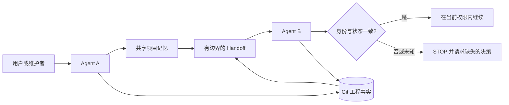

# kang-agent-collab

[English](README.md) | 简体中文 | [日本語](README.ja.md) | [한국어](README.ko.md) | [Español](README.es.md)

[](https://github.com/KanG-ciyuan/kang-agent-collab/releases)
[](LICENSE)
[](https://github.com/KanG-ciyuan/kang-agent-collab/commits/main)

> 一套轻量、Agent-Agnostic 的协作 Skill：用 Git 与共享项目记忆，让不同 AI Coding Agent 可靠地完成项目交接。

`kang-agent-collab` 为不同 AI Agent 提供一套小型共享契约，用来恢复项目上下文、核对实时仓库状态，并安全地把工作交给下一个 Agent。它是 Skill 与协议，不是编排器、平台、服务器或自动记忆系统。

```text
共享项目记忆   解释项目身份、决策与意图
Git            证明当前工程状态
Handoff        携带继续工作所需的最小状态
接手 Agent     重新核验后才继续
```

不需要数据库、守护进程、Dashboard、向量库或托管服务。本仓库是一份基于文件的互操作契约：文本规范、YAML Schema 与模板。仓库内没有任何代码会在运行时强制执行它。

## 为什么需要它

只拿到聊天摘要的 Agent 很容易接错项目、相信过期状态、覆盖别人的修改，或把“工具可用”误认为“已经获准”。本协议把这些失败模式变成明确的检查项与停止条件。

它的核心规则很简单：

> 共享记忆解释项目。Git 证明工程状态。当前任务授予权限。Handoff 是导航——不是真相本身。

### 错误做法与正确做法

| 错误做法 | 正确做法 |
|---|---|
| 靠聊天摘要，或靠一个眼熟的目录名就接着干活 | 通过权威项目入口从 `project_id` 恢复项目 |
| 相信 Handoff 里对仓库的描述 | 自己检查 branch、完整 HEAD、staged、unstaged、untracked 状态 |
| 把“Runtime 能写”当成“我被授权写” | 从 Manifest 或明确指令中读取权限 |
| 通过 stash、reset、clean 未知修改来“降低漂移” | STOP——修改归属未知就是 `D3` |
| 把项目状态复制进每一份记录 | 引用真正拥有该事实的那份记录 |

## 工作方式



规范流程是 `START → READ → VERIFY STATE → WORK → VERIFY RESULT → COMMIT → DISTILL → WRITE-BACK CANDIDATE → HANDOFF → TAKEOVER`。这十个步骤只在唯一权威的 [SKILL.md](SKILL.md) 契约中定义一次。

## Agent 实际会做什么

1. 从已知 `project_id` 找到权威项目入口。
2. 确认 canonical repository 与仓库身份。
3. 检查实时 Git，而不是相信过期摘要。
4. 读取当前 scope、acceptance、permission 与 stop conditions。
5. 只执行已授权的工作。
6. 用证据记录 Result State。
7. 仅在需要时生成有边界的 Write-back Candidate 或 Handoff。
8. 接手时重新验证身份和状态。

## 核心原则

- **先确认身份，再行动。** 相似的目录名不能证明项目身份。
- **Git 是工程事实。** 接手时重新检查 branch、HEAD、staged、unstaged 与 untracked 状态。
- **共享记忆承载语义。** 它记录决策与意图，不替代代码仓库。
- **Capability 不等于 Permission。** Runtime 能执行写入或 push，不代表当前任务允许。
- **修改归属未知就停止。** 不静默 stash、reset、clean 或覆盖未知修改。
- **引用优于复制。** 每个 Authority 只维护一种事实，减少漂移。

## 核心能力

以下每一条都是 Schema 或文字约定，需要人或 Agent 主动遵守。权威定义在 [共享 Contracts](references/contracts.md) 与 [Capability Profiles](references/capability-profiles.md)。

| 能力 | 它提供什么 |
|---|---|
| Project Identity | `project_id`、authoritative entry、canonical repository、项目关系，以及 `verified \| historical \| to_verify` 状态 |
| Lite / Full Manifest | 任务 scope、exclusions、acceptance、写入路径、baseline、提交策略、permissions 与 cost，以及 stop conditions |
| State Drift `D0`–`D3` | 四级分类，每级规定必须采取的动作；`D3` 停止写入并升级处理 |
| Result State | `done \| partial \| blocked \| failed`，每一种都要带证据记录 |
| Write-back Candidate | 对共享记忆的有边界更新，默认只生成候选、不自动写入 |
| Handoff | 上次结果、当前工程状态、证据、断点、下一步动作、阻塞项与禁止事项 |
| Engineering recovery minimum | 面向工程接手的 Handoff 超集 Schema，含逐字段的条件触发规则与明确的必填字段清单 |
| Takeover Check | 十一个重新核验字段，最后落到 `safe_to_continue: yes \| no` |
| Capability Profile | 带日期的 Runtime 观察记录，取值 `available \| conditional \| unavailable \| unknown`，且永不授予任务权限 |

## 产出与工件

本仓库只提供模板与规则，从不提供这些模板的已生成实例。

| 工件 | 以什么形式提供 |
|---|---|
| Lite Manifest、Full Manifest | Schema 见 [共享 Contracts](references/contracts.md)；可用模板见 [`examples/minimal-project/MANIFEST.example.yaml`](examples/minimal-project/MANIFEST.example.yaml) |
| Project Identity 记录 | Schema 见 [共享 Contracts](references/contracts.md)；模板见 [`examples/minimal-project/PROJECT_IDENTITY.example.yaml`](examples/minimal-project/PROJECT_IDENTITY.example.yaml) |
| Handoff、Takeover Check | Schema 见 [共享 Contracts](references/contracts.md)；模板见 [`examples/handoff-example/`](examples/handoff-example/README.md) |
| Capability Profile | 契约见 [Capability Profiles](references/capability-profiles.md)；模板见 [`examples/capability-profile-example/profile.example.yaml`](examples/capability-profile-example/profile.example.yaml) |
| 发现元数据 | [`agents/interface.yaml`](agents/interface.yaml) |
| 包元数据 | [`manifest.json`](manifest.json) |
| 发布过程记录 | [`reports/`](reports/prior-art-research.md)，其中包含一份存储的 trigger-eval 输出 |

每个 `.example.yaml` 都是占位模板，不是填好的记录——例如 [`HANDOFF.example.yaml`](examples/handoff-example/HANDOFF.example.yaml) 里的 `head: REPLACE_WITH_FULL_40_CHARACTER_COMMIT_SHA`。本仓库没有可运行的校验器、没有 eval runner、没有安装器，也没有任何已生成的 Handoff 实例。

运行时，Skill 被要求返回：带证据的 Result State、是否可以安全继续的判断，以及仅在触发条件成立时生成的、有边界的 Handoff 或 Write-back Candidate。

## 恢复流程

恢复被中断的任务正是本协议存在的理由。已知 `project_id` 时，权威恢复链是：

```text
project_id
-> Agent Knowledge Routing Index
-> project Obsidian Authority
-> canonical_repo and current recovery state
-> repository PROJECT_IDENTITY
-> live Git state
-> current Manifest or task permissions, when present
-> safe_to_continue decision
```

routing index 只负责发现，不是另一个项目状态存储；它是部分环境里已存在的可选基础设施，本仓库既不提供也不要求它。如果 Runtime 无法访问 routing index、Authority 或仓库，就停止并请求缺失的最小条目。它绝不猜路径，绝不选择“看起来相似”的项目，也绝不从历史目录名推断 canonical repository。只要 Authority、`PROJECT_IDENTITY`、Git 与 Manifest 之间存在身份冲突，身份就置为 `to_verify` 并必须 STOP。详见 [架构与心智模型](docs/architecture.md) 与 [SKILL.md](SKILL.md)。

## Project Authority 与 Git Truth

不同记录承担不同的职责：

| 记录 | 负责的事实 | 不能替代 |
|---|---|---|
| Project Authority / 共享记忆 | 稳定项目事实、决策、阶段、仓库指针 | 源码与实时 Git 状态 |
| `PROJECT_IDENTITY` | project_id、canonical repository、Authority 指针、项目关系 | 任务历史 |
| Manifest | 当前目标、范围、验收、权限、写入路径、提交策略 | 项目身份 |
| Handoff | 上次结果、准确断点、当前证据、下一安全动作 | Manifest 或聊天记录 |
| Git | HEAD、分支、祖先关系、tracked 内容与 working tree 状态 | 项目目的或权限 |

上表是本文档给出的“五条记录”简化版，而同一件事在本仓库里还有另外两种拆分方式。权威契约 [共享 Contracts](references/contracts.md) 列出的是 **七** 条 owner 条目——它额外包含 `AGENTS`（稳定的执行、安全、Git 与项目边界规则）和 `README`（面向人的目的与稳定能力），并把共享记忆的 owner 明确写成 `Obsidian Authority`。[架构与心智模型](docs/architecture.md) 则换成 **四个相互独立的问题**：这是哪个项目、仓库里现在的真实状态是什么、这个 Agent 被允许做什么、这个 Runtime 能做什么；其中一个问题得到肯定答案，不代表另一个也是。三处不一致时，以 [共享 Contracts](references/contracts.md) 为准，[CONTRIBUTING.md](CONTRIBUTING.md) 也是这样规定的。

共享记忆可以是 Obsidian 笔记、版本化项目文档，或当前 Runtime 能访问的其他位置。Obsidian 不是必需项；本 Skill 不会自动写入 Vault。

## Capability 与 Permission

[Capability Profile](references/capability-profiles.md) 只描述某个具体 Runtime 在已观察条件下能访问或执行什么，不授予当前任务权限。权限来自 Manifest 或用户的明确指令。

例如 `git: available` 表示该 Runtime 能运行 Git，不代表 Agent 可以 commit、push、重写历史或丢弃修改。

## Runtime 模型

协议是平台中立的，但集成依赖具体 Runtime。下面的观察是带日期的时点记录，不是兼容性保证；六份 Profile 的 `last_verified` 都是 `2026-09-12`。

| Runtime profile | 当前证据边界 |
|---|---|
| Codex local | 在特定日期的本地环境中观察到 Skill 加载与核心本地工具；访问范围仍然是会话特定的 |
| Claude Code | 针对某个具体已测版本记录了本地 Skill 与仓库能力；可选集成仍为 conditional |
| Hermes | 观察到索引式 Skill 加载；实际可用工具集与路径访问必须重新核对 |
| OpenClaw | 观察到 workspace/shared Skill 根目录；工具授权仍是 Agent 特定的 |
| ChatGPT Work | 可以交换文本契约；本地 Skill 加载与工具依赖会话 |
| DeepSeek Harness | 在核验具体 harness 之前，运行能力保持 unknown |

这些 Profile **不**构成 universal compatibility。请阅读 [Runtime 集成说明](docs/runtime-integration.md) 与带日期的权威 [Capability Profiles](references/capability-profiles.md)。

## 验证状态

协议版本 `0.2.0` 在 [`manifest.json`](manifest.json)、[`SKILL.md`](SKILL.md)、[`CHANGELOG.md`](CHANGELOG.md)、本 README 及其四个翻译版本、Git tag `v0.2.0`，以及已发布的 `v0.2.0` Release 之间保持一致。公开 Git 历史只有一个发布提交，tag 就指向它；本仓库内没有更早的 tag 或 Release。

### 本文使用的证据等级

| 等级 | 在本仓库中的含义 | 状态标记 |
|---|---|---|
| Repository-verified | 可以从当前 tracked 文件直接核对 | `VERIFIED` |
| Maintainer-reported Pilot evidence | 维护者在已说明条件下观察到，但底层私有材料未公开 | `SIMULATED`——属于断言，无法从本仓库复现 |
| Unknown / to verify | 证据不足以支撑公开能力声明 | `TO_VERIFY` |

### 仓库内可验证的部分

| 检查项 | 如何复现 | 观察到的结果 |
|---|---|---|
| 仓库一致性测试 | `python3 -m unittest discover -s tests -v` | 5 个测试，`OK`——使用标准库 `unittest`，仓库未声明 `pytest` 依赖 |
| 唯一权威 Skill 入口 | 同上测试 | 全仓库只有一份 `SKILL.md` |
| 版本一致性 | 同上测试 | `manifest.json`、`SKILL.md` 与 5 个 README 中都存在 `0.2.0` |
| 相对 Markdown 链接 | 同上测试 | 每个相对链接目标都能解析，无失败项 |
| 包结构（外部、可选） | `python3 /path/to/kang-meta-skill/scripts/validate_skill.py .` | `{"ok": true, "failures": [], "warnings": []}` |
| Trigger 边界 fixture（外部、可选） | 用 `kang-meta-skill` 的 trigger-eval runner 重跑 [`evals/trigger_cases.json`](evals/trigger_cases.json) | 10/10 通过，`pass_rate 1.0`；存储的 [`reports/trigger-eval.json`](reports/trigger-eval.json) 可逐字节复现 |

<details>
<summary>这套测试是什么，又不是什么</summary>

- 它是真实的仓库一致性测试，不是只判断文件存在的 stub：它会跨 7 个文件比对版本号、解析全仓库每个 Markdown 文件的相对链接目标、把 5 个 README 的语言切换器互相比对、拒绝出现第二份 `SKILL.md`，并防止出现机器专属的 home 路径。
- 它**不**检验协议本身。没有任何测试读取 `examples/*.example.yaml`，也没有任何测试把记录拿去和 [共享 Contracts](references/contracts.md) 的 Schema 对校验。D0–D3 规则、`safe_to_continue` 前置条件、Result-State 枚举与 Capability-Profile 契约，全都只是文字约定，没有任何强制执行。
- 没有任何自动运行。本仓库没有 CI：[`.github/`](.github/PULL_REQUEST_TEMPLATE.md) 里只有 issue 与 pull-request 模板，因此测试、外部校验器和 trigger fixture 在 push、PR 或 Release 时都不会运行。`manifest.json` 的 `release_gates` 九项都是人工承诺，不是自动化。
- Trigger fixture 是以 `0.34` 为阈值的 10 条关键词打分用例——4 条 `should_trigger`、3 条 `should_not_trigger`、3 条 `near_neighbor`。它是记录下来的 fixture，不是模型评分式评估，也不能说明运行时行为。
- 已知覆盖缺口：链接检查使用的负向回顾（negative lookbehind）模式无法屏蔽图片徽章外层，因此徽章指向的目标链接没有被检查。本文徽章的链接目标是人工核对过的。

</details>

### 维护者报告的 Pilot 证据

维护者报告了以下有边界的 Pilot 观察：全新会话恢复；项目身份恢复；Authority → canonical repository → live Git 恢复；clean-state takeover；Authority 过期或 working tree 为 dirty 时的恢复行为；无法证明继续合理时的安全 STOP 行为；以及在特定测试条件下不止一个 Runtime 的表现。

两条限制都由仓库自己说明：

- 这些观察属于**维护者报告**。本仓库没有公开任何项目名、逐案例日期、运行时日志、fixture 或可复现材料，且 [验证与证据边界](docs/validation.md) 明确说明 Pilot 的私有路径与会话数据是有意不公开的。不从这些观察推断任何 benchmark 分数或通用成功率。
- [`reports/prior-art-research.md`](reports/prior-art-research.md) 记录：这次仅改文档的发布没有做任何对比性 prior-art 评估。

这不证明它对每个 Agent、Runtime、项目类型或权限模型都成立。

## 示例：一次完整的 Handoff

下面的 `.agent-collab/` 是建议的项目内布局，不是必须部署的服务或全局 Registry。

```bash
mkdir -p /path/to/my-project/.agent-collab
cp examples/minimal-project/PROJECT_IDENTITY.example.yaml /path/to/my-project/.agent-collab/PROJECT_IDENTITY.yaml
cp examples/minimal-project/MANIFEST.example.yaml /path/to/my-project/.agent-collab/MANIFEST.yaml
```

把占位值改成自己的项目，让身份足够明确：

```yaml
project_id: my-project
authoritative_entry: docs/project-authority.md
repository_or_workspace: https://github.com/example/my-project
status: verified
```

### Agent A：完成已授权的工作

契约与语言无关——10 条 fixture 中就有 1 条是中文用例——请求本身就是自然语言：

```text
对 project_id my-project 使用 kang-agent-collab。读取 Project Identity 和当前
Manifest，独立核验实时 Git 状态，只完成获准任务；如果要由其他 Agent 继续，
生成 Handoff。
```

Agent 应先确认项目、读取最少必要 Authority、独立核验 Git，只在 Manifest 范围内工作，并返回证据。

### 完成 Handoff

从 [Handoff 示例](examples/handoff-example/HANDOFF.example.yaml) 和与之配套的 [Takeover Check](examples/handoff-example/TAKEOVER_CHECK.example.yaml) 开始。工程 Handoff 应记录准确的 branch、完整 HEAD、working tree 状态、已完成证据、断点、下一步，以及下一个 Agent 绝不能做的事。

### Agent B：接手

```text
使用当前 Handoff 接手 project_id my-project。重新读取 Authority，重新检查仓库
和 Git，判断 drift；只有 safe_to_continue 为 yes 时才能继续。
```

Agent B 必须拿 Handoff 与当前 Authority 和实时 Git 状态对校验。如果项目身份冲突、脏修改归属未知、缺少权限，或漂移无法安全隔离，它必须停止。

三个示例目录都列在 [`examples/`](examples/README.md) 中；它们的 `.example.yaml` 是占位模板而不是权威契约——一旦示例与 [共享 Contracts](references/contracts.md) 冲突，以契约文本为准。

## 适用与不适用

以下任一种情况需要使用它：

- 从共享记忆与 Git 恢复项目；
- 核验项目身份或当前工程状态；
- 准备或消费跨 Agent 的 Handoff；
- 记录有边界的 Write-back Candidate；
- 在缺少完整聊天历史的情况下恢复被中断的任务。

不要用它来选择 Agent、委派角色、安排任务、创建基础设施或授予权限。它不是编排器、Scheduler、消息总线、Database、Memory Server、Vector Store、Registry、Dashboard、自动写回服务或 Agent 选择层，也不管理 worktree。

**团队组建是另一件事。** 权威 Skill 契约在 [SKILL.md](SKILL.md) 中给出了边界：*“If team composition or specialist delegation is the job, route to `kang-agent-workforce`; that Skill may reference this contract for state transfer.”* 用一句话说：**Workforce 定义团队，Collab 守护交接。** 这是记录在 Skill 契约里的范围声明，不是依赖关系——本仓库不导入、不校验、也不依赖任何同体系项目。这条边界是有意为之的：仓库自带的 trigger fixture 把 “choose an agent and delegate roles for a new product team” 归为 `should_not_trigger`。

## 安全模型

遇到以下情况，Skill 要求停止而不是猜测：

- 项目身份冲突或含糊；
- 风险任务缺少 scope、acceptance、写入路径或权限；
- 脏修改的归属未知（`D3`）；
- 无法提供必要证据；
- 继续下去会越出 Manifest，或改动其他 Agent 的工作；
- 凭据值需要进入 contract、Handoff、共享记忆或 Git。

它不会自动写入共享记忆、不管理 worktree、不选择 Agent、不调度任务、也不做编排。[`manifest.json`](manifest.json) 里的默认权限是只读的恢复与核验；写文件需要当前任务授权，commit 需要 Manifest 或明确许可，push 需要明确的发布许可，写共享记忆默认只允许候选、除非被显式授权。

## 快速开始

以下是通用方式。不同 Runtime 的 Skill 加载方式不同，请以该 Runtime 的官方机制为准。

### 前置条件

- [ ] 接手方 Runtime 能读取根目录 `SKILL.md` 及其相对引用的文件。
- [ ] Runtime 对采用本协议的项目 Authority 与仓库有明确访问权限。
- [ ] 需要核验工程状态时，Git 可用。
- [ ] 写入、commit、push、部署、网络与费用权限分别单独说明。

### 1. 获取协议

```bash
git clone https://github.com/KanG-ciyuan/kang-agent-collab.git
cd kang-agent-collab
```

让 Agent 读取仓库根目录的权威 [SKILL.md](SKILL.md)。如果 Runtime 有 Skill 目录，请按其已确认的加载机制复制或链接整个仓库。[Runtime 集成说明](docs/runtime-integration.md) 给出三种通用模式：仓库引用、Skill 目录、指令附件。

对于支持 Agent Skills registry 格式的安装器，期望的命令是：

```bash
npx skills add KanG-ciyuan/kang-agent-collab
```

这条安装路径依赖具体 Runtime，且在这里**没有**被独立验证过——[`manifest.json`](manifest.json) 仍把 isolated installation check 列为未完成的发布门。使用前请自行做隔离安装验证。上面的 Git clone 与直接引用 `SKILL.md` 才是通用路径。

### 2. 验证包结构

基础仓库检查不需要任何服务：

```bash
python3 -m unittest discover -s tests -v
```

如果你使用 `kang-meta-skill`，它的校验器可以检查本包：

```bash
python3 /path/to/kang-meta-skill/scripts/validate_skill.py .
```

把路径换成你本机安装校验器的位置。该命令只校验包结构，不证明运行时兼容性，也不证明 Pilot 结果。

## 限制

- 本 Skill 不会同步共享记忆或 Git，这些动作由 Agent 或用户用各自工具完成。
- 它无法让不可访问的仓库、Authority 或 Runtime 能力变得可用。
- 它不会自动消除归属或权限上的歧义。
- Runtime 特定的安装方式与工具行为必须在该 Runtime 中逐项验证。
- Pilot 证据是有边界的，不保证在陌生环境中自动恢复。
- 本仓库在运行时没有任何强制执行：没有 CI、没有自带校验器，也没有任何测试把示例记录与契约 Schema 做校验。
- 各语言版本并不等价：`README.zh-CN.md` 是本文的完整翻译，而 `README.es.md`、`README.ja.md`、`README.ko.md` 是精简版，目前缺少 Prerequisites、Troubleshooting 与 FAQ 三节。请以本英文 README 作为完整参考。

## 常见问题排查

| 现象 | 可能原因 | 安全动作 |
|---|---|---|
| Agent 找不到 Skill | 该 Runtime 不识别本仓库的目录结构 | 直接指向根目录 `SKILL.md`，或使用该 Runtime 已确认的 Skill 目录 |
| Authority 与仓库身份冲突 | 指针过期，或选错了项目 | 把身份置为 `to_verify`，请求维护者决策 |
| Handoff 说 clean，但 Git 是 dirty | 交接之后状态发生了变化 | 重新核对归属并判断 drift；绝不 reset 未知修改 |
| Runtime 能 push，但任务没提发布 | 把 Capability 误当成 Permission | 把改动留在本地，显式请求权限 |
| 共享记忆不可访问 | 本会话中路径或集成不可用 | 请求所需的最小条目，而不是猜测 |

## 仓库结构

<details>
<summary>展开已跟踪的文件树</summary>

```text
.
├── SKILL.md                          # 唯一权威 Skill 入口
├── manifest.json                     # 包元数据、权限、发布门
├── references/
│   ├── contracts.md                  # 权威契约定义（规范性规范）
│   └── capability-profiles.md        # 带日期的 Runtime 观察记录
├── docs/
│   ├── architecture.md               # 心智模型、恢复链、非组件
│   ├── runtime-integration.md        # 集成模式与各 Runtime 说明
│   └── validation.md                 # 证据等级与主张边界
├── examples/                         # 通用、无私人路径的占位模板
├── agents/interface.yaml             # 最小发现元数据
├── tests/test_repository.py          # 5 个仓库一致性测试
├── evals/trigger_cases.json          # 10 条记录下来的 trigger 边界 fixture
├── reports/                          # 发布过程记录与存储的 eval 输出
├── .github/                          # Issue 与 PR 模板（无 workflows）
├── README.md                         # 英文权威 README
├── README.zh-CN.md                   # 简体中文
├── README.ja.md                      # 日语（精简版）
├── README.ko.md                      # 韩语（精简版）
├── README.es.md                      # 西班牙语（精简版）
├── CHANGELOG.md
├── CONTRIBUTING.md
├── SECURITY.md
├── CODE_OF_CONDUCT.md
└── LICENSE                           # MIT
```

</details>

仓库只有一份权威 `SKILL.md`。翻译版 README 只解释协议，不构成翻译版 Skill Contract，也不构成额外的 Authority。

## 文档

- [架构与心智模型](docs/architecture.md)
- [Runtime 集成](docs/runtime-integration.md)
- [验证与证据边界](docs/validation.md)
- [共享 Contracts](references/contracts.md)
- [Capability Profiles](references/capability-profiles.md)
- [示例](examples/README.md)
- [贡献指南](CONTRIBUTING.md)
- [安全策略](SECURITY.md)
- [Changelog](CHANGELOG.md)

## FAQ

<details>
<summary>需要服务器或数据库吗？</summary>

不需要。它是基于文件的 Skill 与协议。你可以沿用已有的共享记忆系统，但本协议本身不运营任何服务。
</details>

<details>
<summary>这是 Multi-Agent Framework 吗？</summary>

不是。它不选 Agent、不路由任务、不调度，也没有消息总线。它只定义项目状态如何恢复与交接。
</details>

<details>
<summary>任何 Agent 都能用吗？</summary>

只有在具体 Runtime 能读取契约并访问所需项目证据时才可能使用。这必须逐个 Runtime 验证；本仓库不主张 universal compatibility。
</details>

<details>
<summary>必须使用 Obsidian 吗？</summary>

不必须。Obsidian 只是共享记忆的一种可能位置。版本化文档或其他可访问的 Authority 可以承担同样的角色。
</details>

<details>
<summary>共享记忆和 Git 不一致时怎么办？</summary>

实时 Git 仍是工程事实。如果不一致造成身份冲突或不安全漂移，Agent 会停止并请求缺失的最小决策。
</details>

## 贡献

欢迎提交聚焦的 Contract、示例、Runtime 证据和文档改进。关于 Runtime 的声明必须包含 Runtime 身份、日期、已测能力、条件与缺失证据。详见 [CONTRIBUTING.md](CONTRIBUTING.md)。

## 安全

不要把 Token、密码、Cookie、私钥、Authorization Header 或私人本地路径放进 Manifest、Handoff、共享记忆、示例、Issue 或 commit。私密报告方式见 [SECURITY.md](SECURITY.md)。

## 项目理念

保持小而清晰。优先改进 Contract、示例和证据，而不是增加机器。如果一个功能需要 Scheduler、Database、Dashboard、Registry、Server 或 Orchestration Layer，它大概率属于另一个项目。

---

## 属于 Kang 开源 AI 体系

本项目是「面向企业 AI 转型、Agent 协作与 AI 原生产品交付的证据驱动体系」的一部分。

| 阶段 | 项目 | 作用 |
| --- | --- | --- |
| DISCOVER 发现 | [enterprise-ai-diagnostic-skills](https://github.com/KanG-ciyuan/enterprise-ai-diagnostic-skills) | 在自动化之前，先弄清企业真实业务如何运行 |
| DEFINE 定义 | [kang-product-architect](https://github.com/KanG-ciyuan/kang-product-architect) | 把模糊需求转化为可实施、可审查的产品契约 |
| DEFINE 定义 | [kang-enterprise-process-reviewer](https://github.com/KanG-ciyuan/kang-enterprise-process-reviewer) | 审查流程是否可执行、可追责、可恢复 |
| BUILD & COORDINATE 构建与协同 | [kang-agent-workforce](https://github.com/KanG-ciyuan/kang-agent-workforce) | 角色化的 Agent 数字员工团队与显式交接 |
| BUILD & COORDINATE 构建与协同 | [kang-agent-collab](https://github.com/KanG-ciyuan/kang-agent-collab) | Agent 协作与交接协议 |
| BUILD & COORDINATE 构建与协同 | [kang-frontend-standard](https://github.com/KanG-ciyuan/kang-frontend-standard) | AI 构建界面的前端质量标准 |
| VERIFY 验证 | [kang-b2b-ux-auditor](https://github.com/KanG-ciyuan/kang-b2b-ux-auditor) | 用户能否真正把工作做完 |
| VERIFY 验证 | [kang-product-acceptance-auditor](https://github.com/KanG-ciyuan/kang-product-acceptance-auditor) | AI 构建产品的独立验收 |
| DELIVER 交付 | [kang-github-readme](https://github.com/KanG-ciyuan/kang-github-readme) | 证据感知的 README 工程 |
| DELIVER 交付 | [kang-ppt-skill](https://github.com/KanG-ciyuan/kang-ppt-skill) | 证据感知的演示文稿设计 |

**横向基础设施：** [kang-meta-skill](https://github.com/KanG-ciyuan/kang-meta-skill) —
Skill 工程化、评估与发布治理。

**早期工作：** [ai-agent-rules](https://github.com/KanG-ciyuan/ai-agent-rules)、
[workflow-five-steps](https://github.com/KanG-ciyuan/workflow-five-steps)、
[renovation-agent](https://github.com/KanG-ciyuan/renovation-agent)。

## 开源许可证

本项目采用 [MIT License](LICENSE) 开源。

Copyright (c) 2026 KanG-ciyuan。
