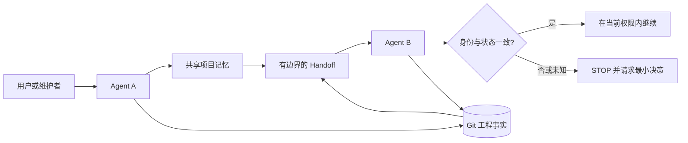

# kang-agent-collab

> 一套轻量、Agent-Agnostic 的协作 Skill：用 Git 与共享项目记忆，让不同 AI Coding Agent 可靠地恢复项目并完成交接。

[](CHANGELOG.md)
[](LICENSE)
[](SKILL.md)
[](docs/validation.md)

[English](README.md) | **简体中文** | [日本語](README.ja.md) | [한국어](README.ko.md) | [Español](README.es.md)

`kang-agent-collab` 为不同 AI Agent 提供一套小型共享契约，用来恢复项目上下文、核对实时仓库状态，并安全地把工作交给下一个 Agent。它是 Skill 与协议，不是编排器、平台、服务器或自动记忆系统。

```text
共享项目记忆   解释项目身份、决策与意图
Git            证明当前工程状态
Handoff        携带继续工作所需的最小状态
接手 Agent     重新核验后才继续
```

不需要数据库、守护进程、Dashboard、向量库或托管服务。

## 为什么需要它

只拿到聊天摘要的 Agent 很容易接错项目、相信过期状态、覆盖别人的修改，或把“工具可用”误认为“已经获准”。本协议把这些失败模式变成明确的检查项与停止条件。

> 共享记忆解释项目；Git 证明工程状态；当前任务授予权限；Handoff 只是导航，不是真相本身。

## 工作方式



规范流程是 `START → READ → VERIFY STATE → WORK → VERIFY RESULT → COMMIT → DISTILL → WRITE-BACK CANDIDATE → HANDOFF → TAKEOVER`。唯一权威的 Skill Contract 是仓库根目录的 [SKILL.md](SKILL.md)。

## 核心原则

- **先确认身份，再行动。** 相似的目录名不能证明项目身份。
- **Git 是工程事实。** 接手时重新检查 branch、HEAD、staged、unstaged 与 untracked 状态。
- **共享记忆承载语义。** 它记录决策与意图，不替代代码仓库。
- **Capability 不等于 Permission。** Runtime 能执行写入或 push，不代表当前任务允许。
- **修改归属未知就停止。** 不静默 stash、reset、clean 或覆盖未知修改。
- **引用优于复制。** 每个 Authority 只维护一种事实，减少漂移。

## Quick Start

以下是通用方式。不同 Runtime 的 Skill 加载方式不同，请以该 Runtime 的官方机制为准。

### 1. 获取协议

```bash
git clone https://github.com/KanG-ciyuan/kang-agent-collab.git
cd kang-agent-collab
```

让 Agent 读取仓库根目录的 [SKILL.md](SKILL.md)。如果 Runtime 有 Skill 目录，请按其已确认的加载机制复制或链接整个仓库。

### 2. 为自己的项目添加身份和 Manifest

下面的 `.agent-collab/` 是建议的项目内布局，不是必须部署的服务或全局 Registry。

```bash
mkdir -p /path/to/my-project/.agent-collab
cp examples/minimal-project/PROJECT_IDENTITY.example.yaml /path/to/my-project/.agent-collab/PROJECT_IDENTITY.yaml
cp examples/minimal-project/MANIFEST.example.yaml /path/to/my-project/.agent-collab/MANIFEST.yaml
```

把占位值改成自己的项目：

```yaml
project_id: my-project
authoritative_entry: docs/project-authority.md
repository_or_workspace: https://github.com/example/my-project
status: verified
```

### 3. 让 Agent A 开始任务

```text
对 project_id my-project 使用 kang-agent-collab。读取 Project Identity 和当前
Manifest，独立核验实时 Git 状态，只完成获准任务；如果要由其他 Agent 继续，
生成 Handoff。
```

Agent 应先确认项目、读取最少必要 Authority、核验 Git，只在 Manifest 范围内工作，并返回证据。

### 4. 写 Handoff

可从 [Handoff 示例](examples/handoff-example/HANDOFF.example.yaml) 开始。工程 Handoff 应记录准确的 branch、完整 HEAD、working tree 状态、已完成证据、断点、下一步和禁止事项。

### 5. 让 Agent B 接手

```text
使用当前 Handoff 接手 project_id my-project。重新读取 Authority，重新检查仓库
和 Git，判断 drift；只有 safe_to_continue 为 yes 时才能继续。
```

如果项目身份冲突、脏修改归属未知、缺少权限，或漂移无法安全隔离，Agent B 必须停止。

## Agent 实际会做什么

1. 从已知 `project_id` 找到权威项目入口。
2. 确认 canonical repository 与仓库身份。
3. 检查实时 Git，而不是相信过期摘要。
4. 读取当前 scope、acceptance、permission 与 stop conditions。
5. 只执行已授权的工作。
6. 用证据记录 Result State。
7. 仅在需要时生成有边界的 Write-back Candidate 或 Handoff。
8. 接手时重新验证身份和状态。

## Project Authority 与 Git Truth

| 记录 | 负责的事实 | 不能替代 |
|---|---|---|
| Project Authority / 共享记忆 | 稳定项目事实、决策、阶段、仓库指针 | 源码与实时 Git |
| `PROJECT_IDENTITY` | project_id、canonical repository、Authority 指针、项目关系 | 任务历史 |
| Manifest | 当前目标、范围、验收、权限、写入路径、提交策略 | 项目身份 |
| Handoff | 上次结果、断点、证据、下一安全动作 | Manifest 或聊天记录 |
| Git | HEAD、分支、祖先关系、tracked 内容与 working tree | 项目目的或权限 |

共享记忆可以是 Obsidian 笔记、版本化项目文档或 Runtime 可访问的其他位置。Obsidian 不是必需项；本 Skill 不会自动写入 Vault。

## Capability 与 Permission

[Capability Profile](references/capability-profiles.md) 只描述某个具体 Runtime 在已观察条件下能访问或执行什么，不授予当前任务权限。例如 `git: available` 不代表允许 commit、push、重写历史或丢弃修改。

## Runtime 与兼容性

协议是平台中立的，但集成依赖具体 Runtime。当前仓库记录了 Codex、Claude Code、Hermes、OpenClaw、ChatGPT Work 与 DeepSeek Harness 的不同证据边界；其中部分能力是 conditional 或 unknown。

这不构成 universal compatibility。请阅读 [Runtime 集成说明](docs/runtime-integration.md) 和带日期的 [Capability Profiles](references/capability-profiles.md)。

## 验证状态

`0.2.0` 在限定条件下已有以下 Pilot 证据：

- fresh-session recovery；
- project identity recovery；
- Authority → canonical repository → live Git recovery；
- clean-state takeover；
- 已观察到 dirty / stale Authority 的恢复情况；
- 无法安全继续时的 STOP 行为；
- 特定条件下多个 Runtime 的初步证据。

这不证明所有 Agent、Runtime、项目类型或权限模型都适用，Level 4 **尚未证明**。公开仓库目前没有包含私有 Pilot 的完整可复现资料，因此这些结果标记为维护者提供的真实 Pilot 证据，而不是通用 Benchmark。详见 [验证与证据边界](docs/validation.md)。

## 安全模型与限制

身份冲突、风险任务缺少范围或权限、脏修改归属未知（`D3`）、无法提供必要证据、继续会越界，或凭据会进入 Handoff/共享记忆/Git 时，Skill 要求停止。

它不会同步记忆或 Git，不会自动写回 Vault，不会管理 worktree、选择 Agent、调度任务或执行编排。Runtime 特定的安装方式与工具行为必须逐项验证。

## 仓库结构与文档

```text
.
├── SKILL.md                       # 唯一权威 Skill 入口
├── references/                   # Canonical contracts 与 Runtime profiles
├── agents/interface.yaml         # 最小发现元数据
├── examples/                     # 通用、无私人路径示例
├── docs/                         # 架构、集成、验证
└── .github/                      # 贡献模板
```

- [架构与心智模型](docs/architecture.md)
- [Runtime 集成](docs/runtime-integration.md)
- [验证与证据边界](docs/validation.md)
- [共享 Contracts](references/contracts.md)
- [Capability Profiles](references/capability-profiles.md)
- [贡献指南](CONTRIBUTING.md)
- [安全策略](SECURITY.md)
- [Changelog](CHANGELOG.md)

翻译版 README 只解释协议，不是独立的 Skill Contract，也不会形成多个 Authority。

## FAQ

**需要服务器或数据库吗？** 不需要。它是基于文件的 Skill 与协议。

**这是 Multi-Agent Framework 吗？** 不是。它不选 Agent、不路由任务、不调度，也没有消息总线。

**任何 Agent 都能用吗？** 只有在具体 Runtime 能读取 Contract 并访问所需证据时才可能使用，必须逐个验证。

**必须使用 Obsidian 吗？** 不必须。任何 Runtime 可访问的权威项目文档都可以承担共享记忆角色。

## 贡献、安全与 License

欢迎提交聚焦的 Contract、示例、Runtime 证据和文档改进。Runtime 声明必须包含身份、日期、条件与缺失证据，详见 [CONTRIBUTING.md](CONTRIBUTING.md)。不要把 Token、密码、Cookie、私钥、Authorization Header 或私人本地路径放入仓库、Issue 或 Handoff；私密报告方式见 [SECURITY.md](SECURITY.md)。

本项目使用 [MIT License](LICENSE) 发布。Copyright (c) 2026 KanG-ciyuan。

## 项目理念

保持小而清晰。优先改进 Contract、示例和证据，而不是增加机器。如果一个功能需要 Scheduler、Database、Dashboard、Registry、Server 或 Orchestration Layer，它大概率属于另一个项目。
