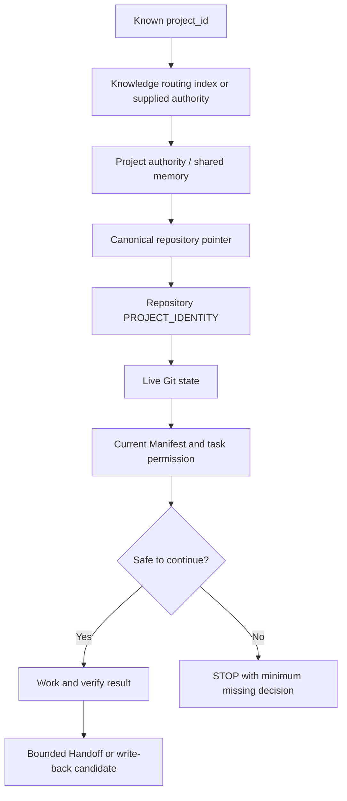

# Architecture and mental model

`kang-agent-collab` is a file-based interoperability contract. It introduces no running service.

## Four independent questions

Every takeover separates four questions that are often accidentally merged:

1. **What project is this?** Project Identity and its authoritative entry answer this.
2. **What is true in the repository now?** Live Git state answers this.
3. **What may this agent do?** The current Manifest or explicit instruction answers this.
4. **What can this runtime do?** A dated Capability Profile answers this.

A positive answer to one question does not imply a positive answer to another.

## Recovery chain

The routing index is optional discovery infrastructure that already exists in some environments; this repository does not provide or require one. If no routing index exists, the user or runtime can supply the authoritative entry directly.

## Authority ownership

Each record owns one kind of truth. The detailed normative table is in [the shared contracts](../references/contracts.md). The architecture depends on references rather than duplicated project state:

- shared memory points to the canonical repository;
- repository identity points back to the authority where appropriate;
- the Manifest points to current scope and permission;
- the Handoff points to exact evidence and the next breakpoint;
- Git is inspected live at takeover.

## Drift and safe takeover

Drift is classified from `D0` through `D3`. `D0` is a clean match. `D1` and `D2` require explainable ownership and explicit boundaries. `D3` means overlap, conflict, or unknown ownership and blocks continued writes.

The receiving agent treats every handoff as a navigation aid. It rechecks identity, authority, Manifest, Git, owned changes, acceptance criteria, and permission before declaring `safe_to_continue: yes`.

## Non-components

The protocol deliberately does not add an orchestrator, scheduler, message bus, database, memory server, vector store, registry, dashboard, automatic write-back service, or agent-selection layer.
